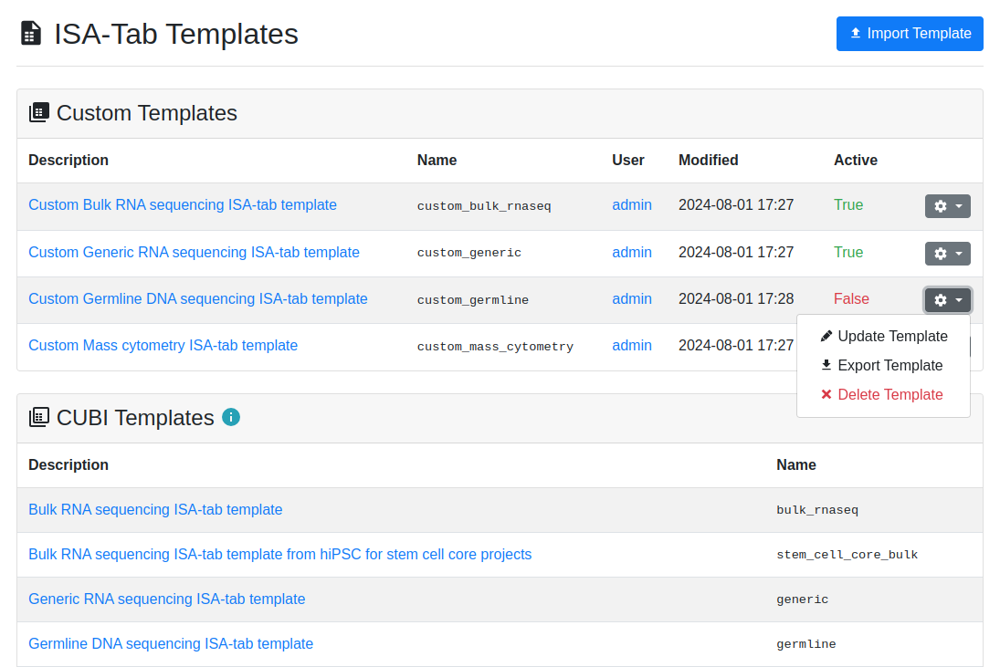
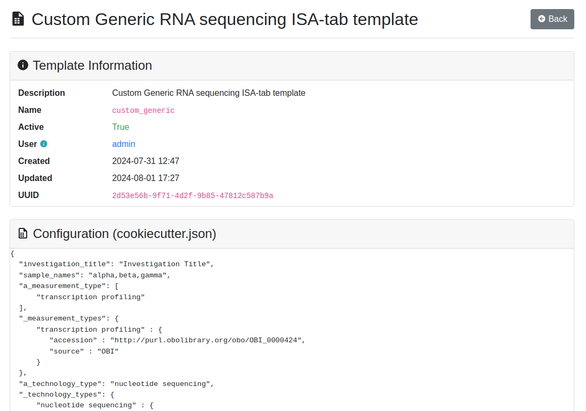
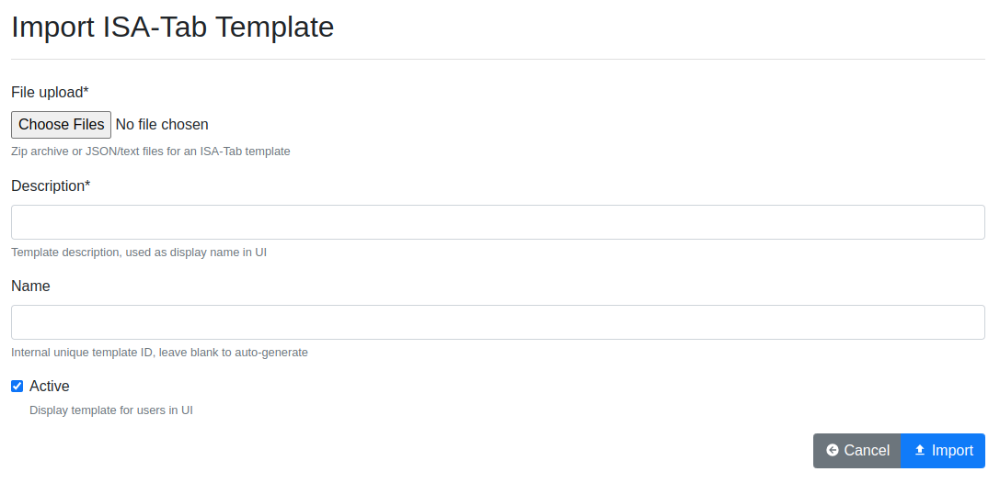

.. _admin_isatemplates:

ISA-Tab Templates Application
^^^^^^^^^^^^^^^^^^^^^^^^^^^^^

By default, SODAR retrieves ISA-Tab templates for the Sample Sheets application
from the `CUBI ISA Templates <https://github.com/bihealth/cubi-isa-templates/>`_
repository. These templates are static and cannot be edited or removed without
upgrading to a new release of the repository in the SODAR Server repository
requirements.

The ISA-Tab Templates application can be used if there is need to dynamically
manage custom templates, or replace the CUBI templates altogether. It provides
administrators the ability to import and export ISA-Tab templates which are
compatible with the
`Cookiecutter <https://github.com/cookiecutter/cookiecutter>`_ templating
software and the format used in the CUBI ISA Templates repository.

.. note::

    To enable the app's backend and access custom templates in the Sample Sheets
    app, make sure ``isatemplates_backend`` is included in your instance's
    ``ENABLED_BACKEND_PLUGINS`` Django setting. For more information, see
    :ref:`admin_settings_backend`.

User Interface
==============

To access the graphical user interface for template management, log in with an
administrator account, open the :ref:`user dropdown <admin_ui_site_apps>` and
select :guilabel:`ISA-Tab Templates`.

Template List
-------------

The template list view is the entry point for the application. It displays the
list of currently imported custom templates, with the following columns
displayed for each template:

Description
    Human readable description for the template. This will be displayed in the
    template selection view in the Sample Sheets app.
Name
    Internal ID for the template, used e.g. in URLs.
User
    The user who last modified the template.
Modified
    The date and time of the most recent template modification.
Active
    Status of the template (active/inactive).
Template Dropdown
    Dropdown for updating, exporting or deleting a template.

If the CUBI templates from the separate repository are enabled, they are
displayed in a second list. For controlling whether to include CUBI templates
on your SODAR instance, see :ref:`admin_settings`.

    ISA-Tab Templates list view

Template Details
----------------

The template detail view can be accessed from the description column link in
the template list. This view provides an overview of the template along with
contents of all files included in the template. The ``cookiecutter.json``
configuration file is displayed first, followed by the ISA-Tab template files.

    ISA-Tab Templates detail view

Template Import and Update
--------------------------

The template import view can be accessed by clicking the
:guilabel:`Import Template` button. The following fields are included in the
form:

File upload
    File selector for uploading the template. The templates can be uploaded
    either as a Zip archive or multiple files. All files for a template must
    be uploaded at once. This consists of the  ``cookiecutter.json`` file,
    the ISA-Tab investigation template file and appropriate study/assay template
    files.
Description
    Human readable description for the template. Must be unique, also taking
    CUBI templates into account.
Name
    Internal ID for the template. Can be left blank, in case one will be
    auto-generated.
Active
    Select box for whether the template is active and displayed to users. This
    is useful if e.g. an error in the template is discovered and it should be
    made inactive while a fix is developed.

    ISA-Tab Templates import/update view

All of the above can be changed for existing templates by selecting
:guilabel:`Update Template` from the template dropdown. The files can be
replaced by new ones by providing a Zip file or individual files in the update
form.

.. note::

    All files must be included also when updating a form as this action will
    replace **all** files in the template. If no files are included, the
    existing files will be left unaltered.

Template File Requirements
==========================

The template files should conform to the
`CUBI ISA Templates <https://github.com/bihealth/cubi-isa-templates/>`_ way of
providing sample sheets. Some important aspects to consider:

- The files must include ``cookiecutter.json``, an investigation file template
  and at least one study file template.
- The ``__output_dir`` field is mandatory.
- Files are expected to be UTF-8 encoded.
- The template must be renderable to a valid ISA-Tab using the default settings
  provided. The import form will validate the template automatically with both
  Cookiecutter and the `AltamISA <https://github.com/bihealth/altamisa>`_ parser
  upon import. The import will fail if critical errors are encountered.

.. hint::

    We recommend looking into the ``cubi-isa-templates`` repository for examples
    on how to create valid templates.
