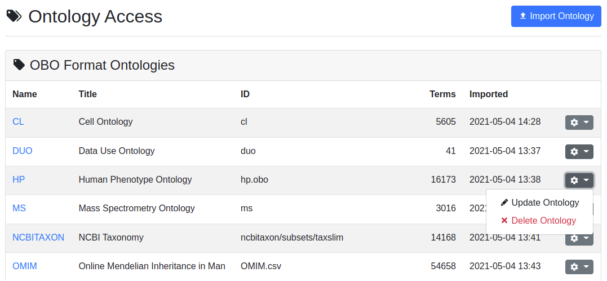
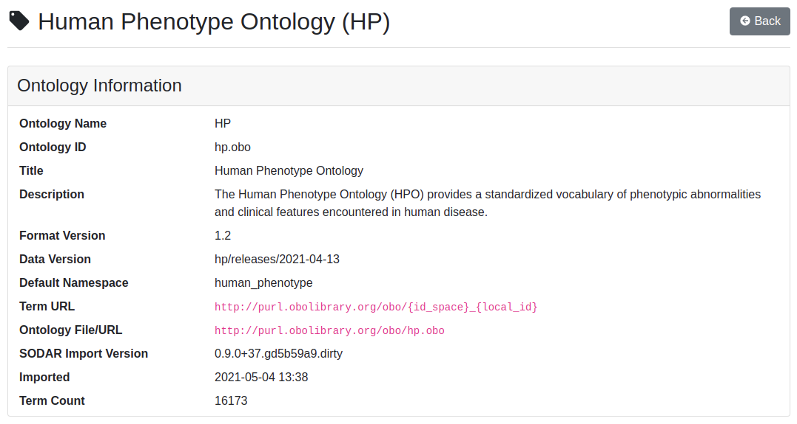
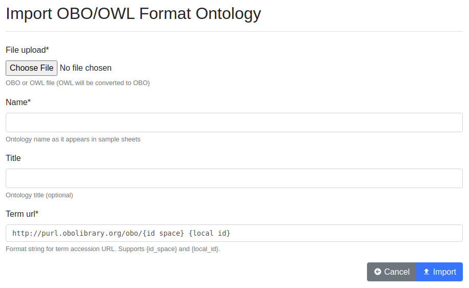

.. _admin_ontologyaccess:

Ontology Access Application
^^^^^^^^^^^^^^^^^^^^^^^^^^^

For :ref:`ontology term lookup <app_samplesheets_edit_ontology>`, SODAR uses a
local database of imported ontologies which are queried from the
:ref:`Sample Sheets <app_samplesheets>` UI. Manual entry of ontology terms is
also supported, but for searching the terms the related ontologies must be
imported into SODAR.

The site-wide Ontology Access application allows administrators to upload and
manage `OBO format ontologies <http://obofoundry.org/>`_ in SODAR.

User Interface
==============

The user interface provides a graphical way to manage the ontologies. To access
the application, log in with an administrator account, open the
:ref:`user dropdown <admin_ui_site_apps>` and select
:guilabel:`Ontology Access`.

Ontology List
-------------

The ontology list view is the entry point for the application. It displays the
currently imported ontologies, with the following columns displayed for each
ontology:

Name
    Name of the ontology as it appears in the sample sheets. It also acts as a
    link to the ontology detail view.
Title
    Optional longer title for the ontology.
ID
    Ontology ID as defined in the ontology or generated from other fields.
Terms
    Number of terms parsed from the ontology.
Imported
    Datetime of the ontology import
Ontology Dropdown
    Dropdown for updating or deleting the ontology.

    Ontology Access list view

Ontology Details
----------------

The ontology detail view, accessed via the ontology name in the list, displays
detailed information of the ontology along with a random example term queried
from the ontology. This can be used to verify that the ontology has been
correctly imported and parsed.

    Ontology Access detail view

Ontology Import
===============

Ontologies can be imported either in the user interface or via a management
command.

UI Import
---------

To import an ontology in the UI, click the :guilabel:`Import Ontology` button.
This will present you a simple form with the following fields:

File Upload
    Upload an OBO, OWL or CSV file here. For more information about accepted
    formats, see below.
Name
    The name of the ontology. This is the name to be referred in sample sheets
    as the name space (e.g. ``HP:xxxxx``), so it should match the name expected
    in the ISA-Tabs used in your projects.
Title
    Optional title for the ontology, mostly for easy recognizing in the Ontology
    Access UI.
Term URL
    The URL pattern for linking terms to their online specifications. This
    expects two parameters, ``{id_space}`` and ``{local_id}}``. If the ontology
    can be found in obolibrary, it is recommended to provide the pattern in the
    form of ``http://purl.obolibrary.org/obo/{id_space}_{local_id}``.

    Ontology Access import form

Management Command Import
-------------------------

With shell access to the SODAR server, you can also use one of the following
commands to import an ontology:

.. code-block:: console

    ./manage.py importobo
    ./manage.py importomim

For details about expected parameters, call these commands with the ``--help``
argument.

Supported Ontology Files
------------------------

The following types of files are supported:

- OBO format ontology files as ``.owl``
- OBO format ontology files as ``.owl``: converted into ``.obo`` before parsing
- `OMIM catalog <https://www.omim.org/>`_ as ``.csv``: converted into "fake" OBO
  with similar properties for term lookup.

.. note::

    SODAR uses the `fastobo <https://github.com/fastobo/fastobo-py>`_ parser for
    importing OBO format ontologies. This is a strict parser which may fail with
    certain ontology files breaking the standard. These can usually be manually
    fixed with little effort to be parseable, but this is out of scope for the
    SODAR documentation. If problems are encountered, it is recommended to
    contact the ontology maintainers and request fixing the invalid data.
