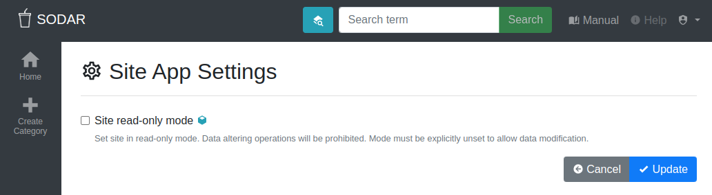

.. _admin_site_app_settings:

Site App Settings Application
^^^^^^^^^^^^^^^^^^^^^^^^^^^^^

This application enables changing site-wide app settings which affect the entire
site. These settings are not project or user specific.

    Site App Settings view

Currently available settings:

Site read-only mode
    This sets the entire site into a read-only mode. No data including project
    metadata, sample sheets or landing zones can be modified, except by
    superusers. Previously started landing zone jobs will be allowed to finish.
    The users will receive a UI notification about the enabling and disabling of
    the read-only mode.
