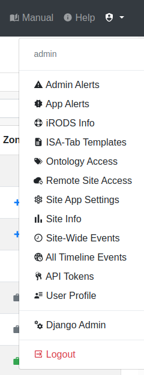

.. _admin_ui:

Admin User Interface
^^^^^^^^^^^^^^^^^^^^

The general SODAR user interface displayed for an admin mostly looks the same as
for the regular user. Differences are detailed in this and following
subsections.

Project Access
==============

Project access it not restricted for administrators. You will be able to access
all projects in the SODAR database and access all project related features.
Similarly, features such as the project list and SODAR search cover all
categories and projects in the system.

.. note::

    iRODS access is not automatically granted to SODAR administrators. For
    accessing the iRODS system you need to follow the practices of your
    organization.

.. _admin_ui_site_apps:

Site-Wide Admin Apps
====================

Additional applications for administration are available in your
:ref:`ui_user_dropdown`.

    Admin dropdown

These new applications are as follows:

`Admin Alerts <https://sodar-core.readthedocs.io/en/latest/app_adminalerts.html#usage>`_
    Manage :ref:`administrator alerts <ui_alerts_admin>` displayed to all users
    in case of e.g. server downtime.
:ref:`Ontology Access <admin_ontologyaccess>`
    Locally import and manage OBO format ontologies for ontology term lookup in
    the Sample Sheets app. This application will be detailed in the following
    subsection.
`Remote Site Access <https://sodar-core.readthedocs.io/en/latest/app_projectroles_usage.html#remote-projects>`_
    Synchronize projects and their member roles between multiple SODAR Core
    based sites.
`Site Info <https://sodar-core.readthedocs.io/en/latest/app_siteinfo.html#usage>`_
    Display information related to this SODAR instance, including statistics,
    enabled applications and back-end server settings.
Django Admin
    Access the Django admin UI.

.. warning::

    Accidental misuse of the Django admin may cause ill effects in the SODAR
    database! It should be used with care and only if absolutely necessary.
