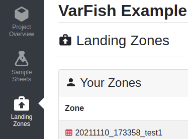

.. _app_landingzones:

Landing Zones Overview
^^^^^^^^^^^^^^^^^^^^^^

Uploading sample data to SODAR projects is done using *landing zones*. In the
context of SODAR, landing zones are temporary user specific file areas in iRODS
for which the user has full write access.

The user prepares their uploads in the landing zone and instructs SODAR to
validate and move the files into the read-only sample data repository. Once
successful, the files can be accessed through the
:ref:`Sample Sheets <app_samplesheets>` app and via iRODS in their permanent
location. If there is a problem during validation or uploading, the entire
operation will be rolled back, allowing the user to edit their data in the
landing zone and try again.

The Landing Zones application provides the user an interface for managing
their landing zone uploads. You can access the application by navigating to a
project and clicking the :guilabel:`Landing Zones` link on the project sidebar.
Alternatively, you can click the icon in the :guilabel:`Zones` column in the
project list found on the SODAR home page.

    Landing Zones link in the project sidebar

The landing zone file transfer process is as follows:

1. Create a landing zone for an assay
2. Upload files into the landing zone
3. Have SODAR validate and move the files into the project sample data
   repository.

Detailed information on the transfer process and managing landing zones in the
application is presented in following sections.

This part of the manual details the graphical user interface of the Landing
Zones app. For programmatic access to these features, see
:ref:`api_landingzones`.
