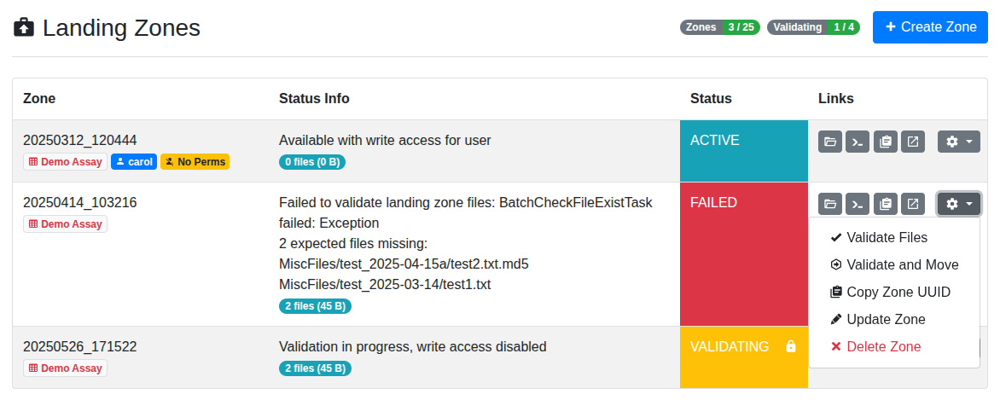

.. _app_landingzones_browse:

Browsing Landing Zones
^^^^^^^^^^^^^^^^^^^^^^

This section describes how to browse your landing zones in the SODAR user
interface.

Landing Zone List
=================

The main view in the Landing Zones application displays a list of your active
landing zones (also referred to as "zones" for brevity).

    Landing zone list

The following details are available for each landing zone:

Zone
    The title of the zone along with a tooltip for verifying to which assay the
    zone belongs in. The zone name also acts as its collection name in iRODS.
    In addition to the title, this column displays further landing zone
    information as badges:

    - **Assay Badge:** This displays the name of the assay the landing zone is
      linked to, with a link to the assay in the Sample Sheets app.
    - **User Badge:** When viewing the list as a owner or delegate, you can see
      zones of other users. For these zones, the user who created the zone is
      displayed as a badge.
    - **Configuration Badge:** If a special configuration is used for the zone,
      the configuration title is presented as a badge.
    - **Permission Warning Badge:** If you can see other users' zones and a user
      has lost project permissions after creating the zone, you will see a badge
      warning you about the zone's original creator being unable to access it.
Status Info
    Detailed status information on the most recent action performed on the zone.
    Successful actions are described here along with detailed information on
    failures. Long status messages are truncated by default, but you can click
    the :guilabel:`See more` link to load the full status. Also included is a
    badge displaying the zone's current file count and size in iRODS.
Status
    A coloured representation of the current zone status. If the zone is
    currently locked for read-only access due to an ongoing operation, a lock
    icon is also displayed.
iRODS Links
    Four buttons with iRODS links for the zone are presented here.
Zone Dropdown
    For each active zone, there is a dropdown menu for zone specific operations.

.. _app_landingzones_browse_owner_access:

Project owners and delegates will be able to see active zones of other users in
the project in a separate list within the same view. They can perform the same
validation, moving and deletion actions as the zone owner. Starting in SODAR
v1.1, owners and delegates also have iRODS read/write access to zones of other
users. This functionality was introduced in SODAR v1.1.

.. hint::

    For legacy landing zones created on SODAR versions older than 1.1, an
    administrator must run the ``syncmodifyapi`` administrator command to enable
    owner and delegate iRODS access.

Status Types
============

The following status types can appear during the lifetime of a landing zone:

CREATING
    Creation of landing zone in iRODS in process.
NOT CREATED
    Creating landing zone in iRODS failed.
ACTIVE
    Available with write access for the user.
PREPARING
    Preparing transaction for validation and moving.
VALIDATING
    Validation OK, moving files into sample data repository.
MOVED
    Files moved successfully, landing zone removed.
FAILED
    Validation or moving failed.
DELETING
    Deletion of landing zone in process.
DELETED
    Landing zone deleted.

iRODS Links
===========

The buttons for iRODS linking for the landing zone are identical to the ones
seen in the :ref:`Sample Sheets <app_samplesheets>` application:

|btn_assay_list| List Files
    Opens a modal with a flat iRODS file list of the landing zone.
|btn_assay_path| Copy iRODS Path into Clipboard
    Copies the iRODS path of the landing zone, to be used with iRODS iCommands.
|btn_assay_url| Copy WebDAV URL into Clipboard
    Copies the entire WebDAV URL for the landing zone path.
|btn_assay_webdav| Browse Files in WebDAV
    Opens a new browser tab with the Davrods web interface for browsing the
    landing zone collection through WebDAV.

iRODS File List Modal
=====================

The iRODS file list modal is slightly different from the similar modal in the
Sample Sheets app. It displays collections in addition to files to help
visualize which root level collections are expected. Furthermore, a check mark
is displayed on the right hand side column for files, if the expected ``.md5``
checksum file is accompanying the actual data file.

    iRODS file list modal for a landing zone

.. |btn_assay_list| image:: _static/app_samplesheets/btn_assay_list.png
.. |btn_assay_path| image:: _static/app_samplesheets/btn_assay_path.png
.. |btn_assay_url| image:: _static/app_samplesheets/btn_assay_url.png

