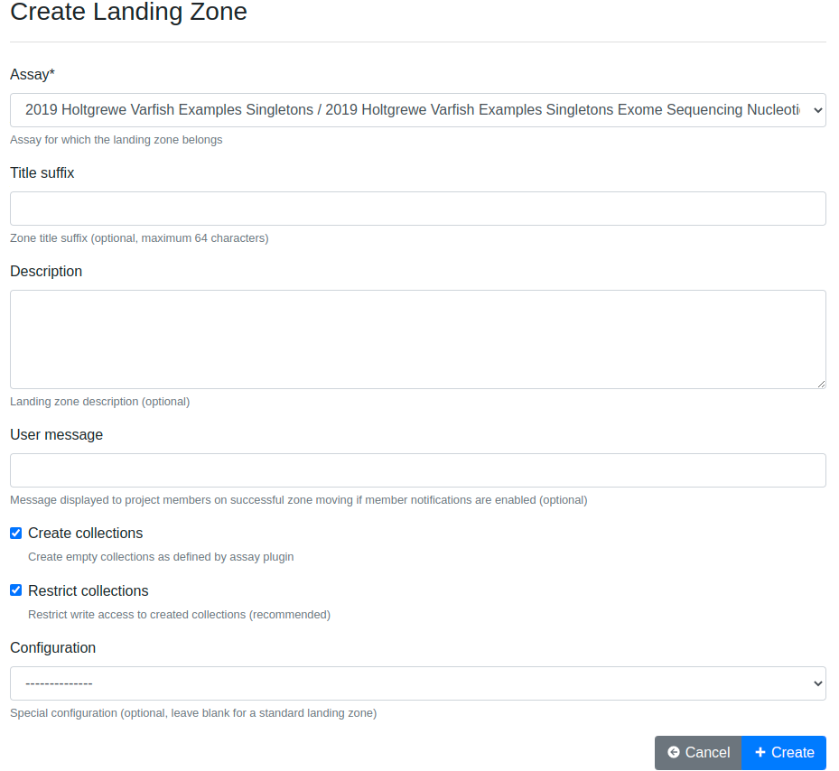

.. _app_landingzones_create:

Landing Zone Creation
^^^^^^^^^^^^^^^^^^^^^

Creating a landing zone and uploading data into a project requires that sample
sheets are available in the project and the corresponding iRODS collections have
been created. For instructions on how to set up sample sheets for a SODAR
project, see :ref:`metadata_recording` and :ref:`app_samplesheets_create`.

Creating landing zones and uploading files is permitted to users with the
project contributor access level or higher.

There is no limit on how many zones you can create and multiple simultaneous
landing zones for a single assay are allowed.

Initially navigating to the Landing Zones app presents you a notification on
no zones being available, with a :guilabel:`Create Zone` button on the right
hand side.

    Landing zone list with no zones

Clicking the button opens up the landing zone creation form, which allows you to
set up and configure your new landing zone.

    Landing zone creation form

The form contains the following fields:

Assay
    The assay under which the files in this landing zone will be uploaded.
Title Suffix
    Optional suffix for the landing zone title, mostly usable for
    differentiating between multiple zones.
Description
    Optional description for e.g. notes regarding the landing zone.
User Message
    Optional message displayed to project users upon successful validation and
    upload of this zone. This can contain e.g. a description of the files
    uploaded.
Create Collections
    If set true, this will automatically create the expected root level
    collections under the zone. This helps to e.g. assure the expected
    collection names for libraries and avoid errors such as typos. Creation is
    enabled by default. When moving files from the landing zone, empty
    collections will not be created in the sample repository.
Restrict Collections
    If set true and "create collections" is enabled, user write access is
    restricted to the automatically created collections. Subcollections can be
    freely created under existing collections, but the user has no permission
    to create new collections in the landing zone root. This will prevent
    accidental uploads to collections with names not corresponding to paths
    expected in the related sample sheets. If there is need to e.g. upload data
    corresponding to libraries not yet in the sample sheets, this option can be
    set false.
Configuration
    Selection for special configurations of landing zones with extra features.
    In most use cases this should be left blank.

Once you have filled out the form, clicking :guilabel:`Create` will start the
zone creation process and redirect you to the landing zone list, where you can
see the zone status and move further with file uploads.

The next sections will provide instructions on browsing your landing zones and
how to proceed with your file uploads.

Landing Zone Update
^^^^^^^^^^^^^^^^^^^

Landing zones can be updated by following the :guilabel:`Update Zone` link on the
dropdown menu on the right hand side of the zone list. This opens up the same
form as in the creation process, with the fields pre-filled with the current
values. Currently the only fields that can be updated are description and user message.
Once you have made your changes, click :guilabel:`Update` to save them.
