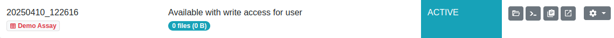
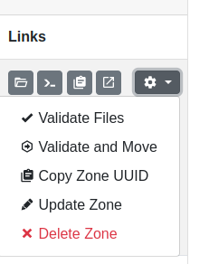
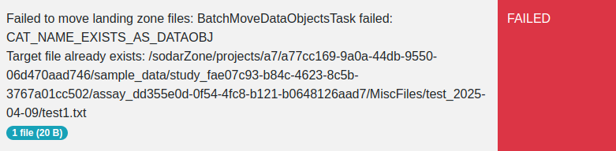

.. _app_landingzones_transfer:

Landing Zone File Transfer
^^^^^^^^^^^^^^^^^^^^^^^^^^

This section describes how you can upload, validate and transfer files into the
project sample repository using landing zones.

Uploading Your Files
====================

Uploading files is permitted to users with the project contributor access level
or higher. If you have :ref:`created your zone <app_landingzones_create>`
and it is visible in the :ref:`zone list <app_landingzones_browse>` with
the status of ``ACTIVE``, you can proceed with uploading data into your landing
zone.

    Landing zone with ``ACTIVE`` status

You will need iRODS access and a personalized SODAR iRODS environment file to
upload your files into the landing zone. For instructions on the use of iRODS
with SODAR, see the :ref:`iRODS access documentation <data_transfer_irods>` as
well as the `iRODS manual <https://docs.irods.org>`_.

The actual uploads can be performed in a variety of ways from manual uploads
using `iCommands <https://docs.irods.org/master/icommands/user/>`_ to specific
file ingestion scripts. Please consult the conventions of your project and team.

Regardless of the upload method, SODAR expects the uploaded data to follow
certain conventions:

Scope of Landing Zones
----------------------

In the current implementation, all data is uploaded on the assay level. A single
landing zone is always linked to an assay and should contain files specific to
that assay.

.. attention::

    Study level data repositories and related landing zones may be implemented
    in a further SODAR release.

File Checksums
--------------

SODAR requires for an MD5 checksum file to accompany each file when uploaded to
the server. This file is used to verify the original checksum against the one
calculated in iRODS once the upload is complete. The file should be named with a
``.md5`` suffix following the name of the data file. E.g. a file named
``filename.bam`` should be uploaded together with a checksum file called
``filename.bam.md5`` in the same collection.

From SODAR v0.14 onwards, iRODS checksums not present after the upload are
automatically calculated prior to validating the landing zone. This means
uploading with the ``-k`` argument or separately calling ``ichksum`` are no
longer required. The calculation step may take some time with large landing
zones.

Collection Structure
--------------------

SODAR enforces a certain root collection structure for assay data, which must
also be followed within the landing zone. If the *Create Collections* option is
set true when creating the zone, these expected collections are created
automatically. If collections are left empty in the landing zone, they will not
be created in the sample repository.

If the *Restrict Collections* option is unset, SODAR allows uploading data into
root level collections other than the expected ones. However, these will **not**
be visible in the Sample Sheets user interface. Thus, this is not recommended.

There are three common root level collections for all assays:

``MiscFiles``
    Miscellaneous assay specific files not belonging under any other collection.
``ResultsReports``
    Result and reports files related to the assay.
``TrackHubs``
    UCSC Genome Browser track hubs. For more information see
    :ref:`app_samplesheets_irods_ticket`.

Other collections expected for a specific landing zone depend on the assay
configuration. For detailed reference on which assay type expects which
collections, see :ref:`metadata_advanced`.

.. _app_landingzones_transfer_prohibit:

Prohibited File Types
---------------------

Project owner or delegate may prohibit the uploading of certain files by file
suffix. The user is notified of a possible restriction in the zone list and
create view UI. This limitation is project specific.

If prohibited file types are uploaded, landing zone validation and moving will
fail with an error message listing the offending files. Removing those files and
associated checksum files will allow you to validate and move your landing zone.

    Prohibited files alert

Replacing Files
---------------

In the current implementation, overwriting existing files is not allowed. Upon
attempting to upload a file into a collection where an identical file name
already exists, the operation will roll back with a failure.

.. hint::

    If an existing file needs to be updated or replaced, either upload the new
    version with a different name or
    :ref:`request for the deletion of the original file <app_samplesheets_irods_delete>`.

Validating Files
================

To ensure your uploaded files are OK for being transferred into the project
sample data, you can call on SODAR to validate them. To do this in the Landing
Zones UI, open the dropdown next to your landing zone in the zone list
and click :guilabel:`Validate Files`.

    Landing zone dropdown

Clicking the link will temporarily lock the landing zone for read-only access
and start the validation process in the background. Duration of validation
depends on the amount of files in your zone. You can monitor the status of this
process in the landing zone list view. You will also receive an alert once the
validation is done. In the validation phase, missing iRODS checksums are also
calculated so they can be compared to the corresponding ``.md5`` files.

    Landing zone with ``VALIDATING`` status

If the validation was successful, your landing zone will return to the
``ACTIVE`` status and restore your write access. You can then upload more files
or go ahead with moving your files into the read-only sample data repository.

    Landing zone status after successful validation

If an error is encountered during validation, the landing zone status is set
to ``FAILED``. The *Status Info* field in the landing zone list will contain
details of what failed. In most cases, these fall into the following categories:

- File checksum does not match the accompanying MD5 checksum file.
- An MD5 checksum file is missing.
- An MD5 checksum file is present but the related file is missing.

    Landing zone status after failed validation

If there have been problems with multiple files, all the errors are detailed
sequentially in the zone status info. At this point you can go back to fix the
problems with your files and retry validation again.

Moving Files
============

Once you have finished uploading files into your landing zone and wish to
transfer the files into the read-only sample data repository, you should open
the dropdown next to your landing zones and select
:guilabel:`Validate and Move`. This will trigger the validation process as
described above and if successful, automatically proceed to move the files under
the assay. As with validation this is done in the background and you can monitor
the process in the landing zone list.

.. hint::

    If it is enabled on the SODAR server, it is also possible to trigger moving
    of files by creating an empty file with a specific name under your landing
    zone. By default, this file is called ``.sodar_validate_and_move``. If you
    wish to use this feature and are unsure of how the server is configured,
    contact the server administrators for further information.

If successful, the status of your landing zone will be updated to ``MOVED``,
with the count of moved files excluding the MD5 checksum files. Cache update for
sample sheets is also initiated to ensure iRODS links are up-to-date in the UI.
You can then navigate to the :ref:`Sample Sheets <app_samplesheets_browse>` app
to view your files in the assay.

    Landing zone with ``MOVED`` status

You will also receive an alert for the successful moving operation.

The landing zone is deleted after successfully moving files. The next time you
view the zone list, it will no longer be displayed. To upload more files at a
later time, you must create a new zone.

In case of a failure, the landing zone status is set to ``FAILED`` along with a
description of the encountered error. The operation is rolled back, with the
files returned to your landing zone and write access enabled. Similar to
validation errors, you can then fix the reported error and retry the moving
operation.

    Landing zone status after failed moving

.. hint::

    The exact list of files transferred from a landing zone to the sample data
    repository can be reviewed in the "extra data" modal for the related
    :guilabel:`Landing Zone Move` :ref:`Timeline <ui_project_timeline>` event.
    This information is currently available for project owners and delegates.

Landing Zone Deletion
=====================

You can delete any of your landing zones by clicking :guilabel:`Delete Zone`
in the landing zone dropdown. After a confirmation dialogue, the landing zone
along with all associated files in iRODS will be deleted.

.. warning::

    Deleting a landing zone can **not** be undone!
