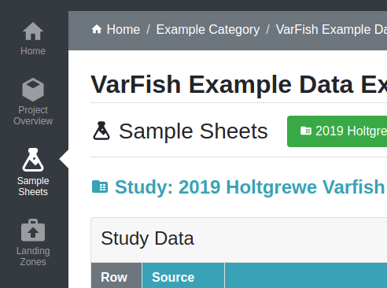

.. _app_samplesheets:

Sample Sheets Overview
^^^^^^^^^^^^^^^^^^^^^^

In SODAR, *sample sheets* model the study design metadata for research projects.
They contain links and shortcuts to data files and enable integration with
external tools.

The Sample Sheets application is used to import, browse, edit and the study
metadata. It also serves as the access point to files related to the studies,
hosted on the `iRODS <https://irods.org>`_ distributed mass storage system.

You can access the Sample Sheets app by navigating to a project and clicking on
the Sample Sheets link on the project sidebar. Alternatively, you can click
on the icon in the *Sheets* column in the project list found on the SODAR home
page.

    Sample Sheets link in the project sidebar

Detailed information on using the application for various sample sheet related
actions are detailed in following subsections.

This section details the graphical user interface of the Sample Sheets app. For
programmatic access to most of these features, see :ref:`api_samplesheets`.
