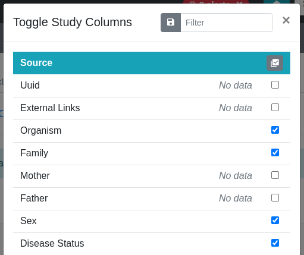

.. _app_samplesheets_browse:

Browsing Sample Sheets
^^^^^^^^^^^^^^^^^^^^^^

This section details the user interface for browsing sample sheets in a project
and accessing related files.

For modeling study data, SODAR uses the
`ISA-Tab model <https://isa-tools.org/format/specification.html>`_, which is a
part of the `ISA framework <https://isa-tools.org/>`_. In ISA-Tab, experiment
data is grouped under an *investigation* into one or more *studies*, which in
turn contain one or more *assays*. The data is generally visualized as
spreadsheet-style tables for studies and assays. Basic knowledge of the ISA-Tab
model is helpful in reading this part of the manual. For further information
on providing ISA-Tab into SODAR, see :ref:`metadata_recording`.

User Interface
==============

Upon entering the Sample Sheets app with existing sheets, you will see a tabular
layout of study and assay tables along with a set of controls. In this view, one
study is presented on each screen. In case of a project with multiple studies,
they will appear as tabs in the navigation section.

    Sample Sheets default UI

From top to bottom, you will see the following elements:

Navigation and Operations
    This section contains a navigation menu for switching between studies and
    the sample sheet overview. The :guilabel:`Sheet Operations` dropdown lists
    actions to be performed depending on the user's role in the project.
    Temporary status messages for e.g. editing are also displayed here.
Study Title
    The study title is displayed here. To the right hand side you will find
    a badge listing iRODS file statistics for the study. The rightmost buttons
    link out to iRODS storage on the study level.
Study Table
    The study table lists the study sources (e.g. patients or donors), sample
    collection processes and samples derived from the sources. The table header
    provides links for column visibility selection, table export as Excel and
    filtering visible table rows. The table itself displays tabular ISA-Tab data
    for the study table together with additional iRODS and IGV links.
Assay Title
    For each assay, the assay title is displayed. Similar to the study title,
    iRODS links on the assay level are included.
Assay Shortcuts
    The assay shortcuts card provides iRODS links to specific collections on the
    assay level.
Assay Table
    The assay table is similar to the study table, presenting processes and
    materials derived from the sample onwards.

Sheet Operations Dropdown
=========================

Operations to be performed on the project's sample sheets can be found under
the :guilabel:`Sheet Operations` dropdown. These actions will be detailed in
further sections under the manual. An example of the dropdown can be seen below.
Note that available operations depend on the user's membership role in the
project and the current status of the project sample sheets.

    Sheet Operations dropdown menu

Study and Assay Tables
======================

The study and assay tables follow ISA-Tab conventions with certain enhancements.
Sources, samples, materials and processes are colour coded in the topmost table
header to clarify navigation.

    Node colours in study and assay tables

Tables offer the following functionality:

Column Resizing
    All columns in the tables can be freely resized by dragging on their edges.
Row Sorting
    Tables can be sorted by a specific column by clicking its header.
Row Filtering
    For filtering rows, a string can be entered into the *Filter* text input in
    the table header.
Drag Selection
    Multiple cells can be selected by holding down the left mouse button and
    "painting" cells. They can be copied into the clipboard with ``Ctrl+C``,
    ``Meta+C`` or ``Cmd+C``.

In SODAR certain cells offer special notation of data:

Cells with Units
    Columns accompanied by units are grouped into a single column for display
    purposes. If the unit is set for a cell, it is displayed after the value
    using a different colour.
Contacts
    Contact columns are rendered as links to the contact email, if email is
    present in the values.
HPO Terms
    HPO terms are a special case, where a "copy to clipboard" button is included
    for copying the actual HPO term IDs, while the textual representations are
    displayed in the cell for users.
External Links
    The "external links" columns are a special case where key-value pairs are
    displayed as badges. If configured on the server side for a specific key,
    the badges will link out to the ID on the appropriate service.
Simple Links
    Generic text cells may also contain arbitrary hyperlinks which can target
    either internal or external resources.
Files
    Cells in file columns link out to iRODS files if present. For more details,
    see the "iRODS File Linking" section.

.. hint::

    The maximum height of study and assay tables can be set in your user
    settings in the :ref:`ui_user_profile`.

Toggling Column Visibility
==========================

Columns in a table can be displayed or hidden by the user. Not all available
columns may be initially visible. For example, columns with no data appear
hidden by default.

To choose which columns to display, click the eye icon in the table header,
displayed in the screenshot below.

    Table header with column visibility toggle button highlighted

Clicking the button opens a modal in which you can hide or unhide columns using
the accompanying checkboxes. Columns can be toggled individually or for an
entire material or process. Name columns, or protocol columns in the case of
unnamed processes, will always be displayed and can't be hidden.

    Column toggling modal for a study table

For assay tables, study table columns (up to sample) are hidden by default.
However, they can be made visible as needed using the assay table's modal.

Upon exiting the modal, your choices for column visibility are saved for the
project. They will remain as previously set when you next navigate to the
project, except if the sample sheets are replaced.

Filtering for specific columns in the modal can be done using the *Filter* text
input in the modal title bar. For project owners and delegates, there is also a
button for saving current column visibility choices as the default for all
project members.

iRODS File Linking
==================

This section describes how the Sample Sheets application UI links metadata to
sample data files in iRODS mass storage. The sample data is read-only, with
uploading and validating done using Landing Zones.

The exact methods of linking metadata to files in iRODS depend on the sample
sheet configuration and assay types. This section presents possible ways iRODS
files can be linked in this application, but all of them may not apply to the
specific projects on which you are working. For a detailed reference of how
iRODS links are applied to different sample sheets, see
:ref:`metadata_advanced`.

Certain buttons may appear inactive in the UI. This denotes that the collections
these link point to have not been created or do not contain any files.

.. note::

    Users with a :ref:`project viewer <ui_project_members_roles>` role can only
    see the sample sheets study design metadata in this application. iRODS links
    will not be displayed.

Study Links and IGV Integration
-------------------------------

In study tables, a pinned right hand side column for study level links for iRODS
and `Integrative Genomics Viewer (IGV) <https://software.broadinstitute.org/software/igv/>`_
integration is presented for certain configurations. These links are provided
under two buttons for each row.

    Study link buttons

The buttons consist of:

|btn_assay_webdav| Open IGV Session File
    This button automatically opens the IGV session file for a case or a
    pedigree (the latter in case of a germline study) in IGV running on your
    system.
|btn_assay_list| View Links
    This button opens a modal containing links to the generated IGV session
    file, along with links to the most recent BAM and VCF files for a case or a
    pedigree.

    Study link modal

In the modal, you can both access the URLs of files directly, or merge them into
your currently open IGV session.

If certain file path patterns are omitted from IGV inclusion in project
settings, a blue info icon will be displayed next to the BAM/CRAM or VCF
section. Hovering your mouse on this icon will display the list of patterns
omitted. These settings can be changed by the project owner or delegate in the
:guilabel:`Update Project` view.

For more detailed information on using IGV with SODAR, see
:ref:`ext_tool_igv_setup` as well as :ref:`ext_tool_igv_opening`.

Assay Shortcuts
---------------

Assay shortcuts are displayed as a separate card on top of each assay table.
These consist of assay level collections in iRODS, along with optional track hub
collections to be used with the
`UCSC Genome Browser <https://genome.ucsc.edu/>`_. For more information on using
track hubs, see :ref:`app_samplesheets_irods_ticket`.

Common assay level collections for all projects consists of
:guilabel:`Results and Reports` and :guilabel:`Misc Files`. Other collections
may be included for specific assay types. For more details, see
:ref:`metadata_advanced`.

    Assay shortcuts example

For each collection, four buttons for iRODS access are presented:

|btn_assay_list| List Files
    Opens a modal with an iRODS file list of the specific collection.
|btn_assay_path| Copy iRODS Path into Clipboard
    Copies the pure iRODS path to be used with e.g. iRODS iCommands.
|btn_assay_url| Copy WebDAV URL into Clipboard
    Copies the entire WebDAV URL for the path for e.g. easy linking with
    other systems.
|btn_assay_webdav| Browse Files in WebDAV
    Opens a new browser tab with the Davrods web interface for browsing the
    collection through WebDAV.

Assay Table Links
-----------------

Inside the assay table, row-specific iRODS links are shown on the pinned right
hand side column, if enabled for the assay type. The buttons shown are the same
ones as in the assay shortcuts.

In addition to this, file names of materials representing file types in the
ISA-Tab cells link directly to the corresponding file in WebDAV and iRODS, if
the file is present.

iRODS File List Modals
----------------------

Clicking an iRODS file list button in an assay opens up an iRODS file list
modal. It displays a flat list of files under the related iRODS collection,
including files in all of its subcollections. The list can be filtered in the
modal's title bar. The file links link out to the WebDAV.

    iRODS file list modal

If you have project contributor access or higher, you'll also see buttons for
issuing or cancelling iRODS delete requests for these files, in case of e.g. an
accidental upload into the read-only sample repository. Further information on
these requests can be found in :ref:`app_samplesheets_irods_delete`.

If you prefer navigating through the subcollections instead of having a flat
list of files, you can click the rightmost "Browse Files in WebDAV" button
for folder style browsing.

Overview Tab
============

The overview tab displays additional information on the investigation, studies
and assays, as well as statistics about the study contents.

    Sample sheet overview

.. |btn_assay_list| image:: _static/app_samplesheets/btn_assay_list.png

.. |btn_assay_webdav| image:: _static/app_samplesheets/btn_assay_webdav.png
