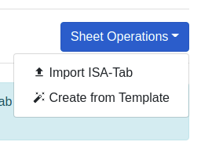
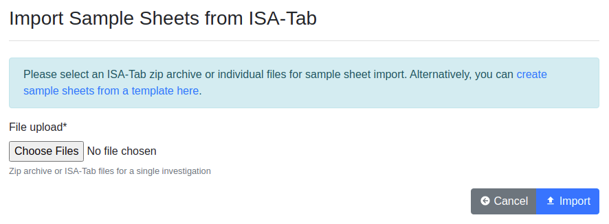
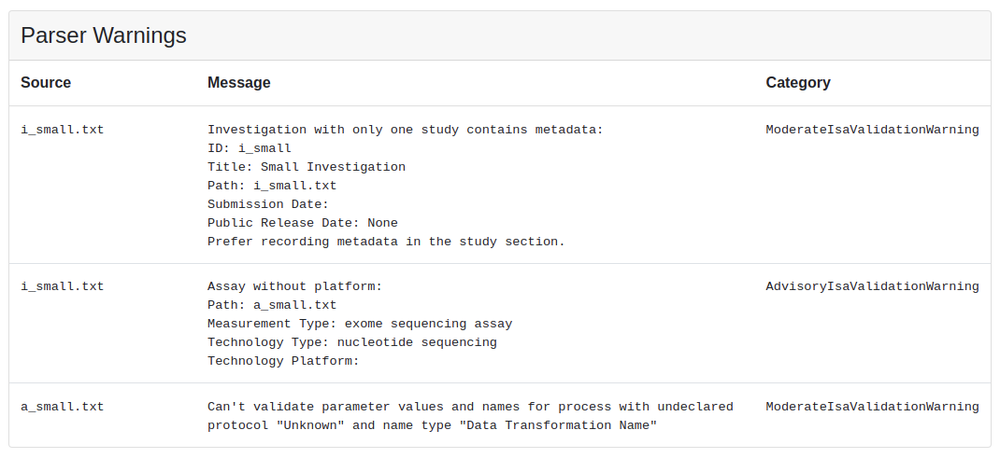
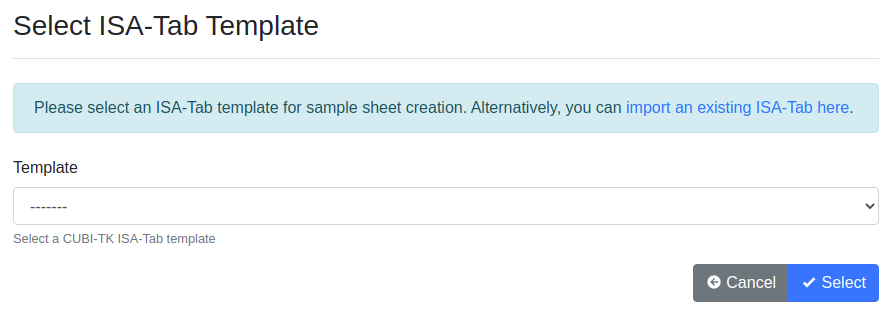
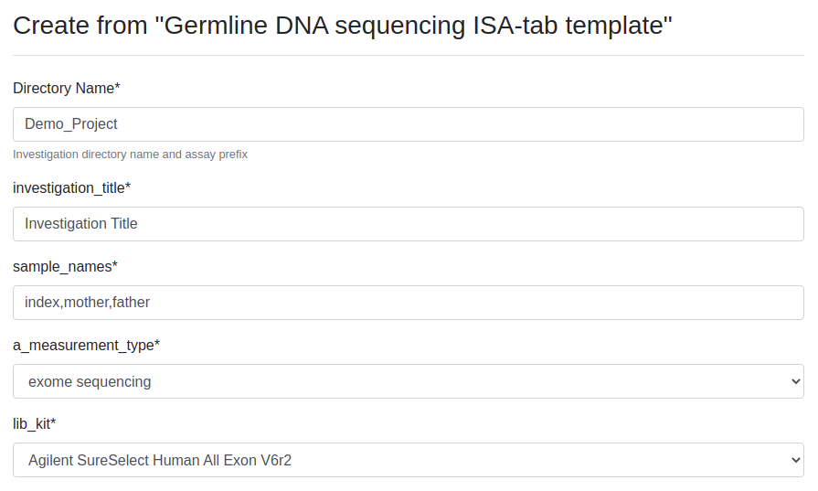

.. _app_samplesheets_create:

Importing and Creating Sheets
^^^^^^^^^^^^^^^^^^^^^^^^^^^^^

To provide your sample sheets into SODAR, you can either import them from
existing ISA-Tab files or generate them from templates within the UI. This
section describes both methods. Furthermore, we discuss creating iRODS
collections for your sample sheets, as well as replacing sample sheets with an
updated version of the original ISA-Tab.

For further information on how to prepare sample sheets and what is expected of
the metadata, see :ref:`metadata_recording`.

Import from ISA-Tab
===================

When navigating into the Sample Sheets app on a project with no sample sheets,
the *Sheet Operations* dropdown presents a user with contributor access or
higher with the options of importing an ISA-Tab or creating it from a template.

    Sheet Operations dropdown with no sheets available

When selecting *Import from ISA-Tab*, you are presented with a simple form to
upload existing ISA-Tab files. You can either upload a zip archive containing
all the files of an investigation, or select multiple files and upload them at
once.

.. note::

    When uploading multiple files instead of a zip archive, all files for the
    investigation must be present or the import will fail!

    ISA-Tab import form

In case of a successful import, you will be redirected to the main sample sheets
view, where you should see the study and assay tables for your imported sample
sheets.

Parser Warnings
---------------

SODAR uses the `altamISA <https://github.com/bihealth/altamisa>`_ parser for
importing the ISA-Tab files. In some cases, parser warnings are raised for a
successful import. In such a case, SODAR will alert you about this on import. If
you want to review the raised warnings, open the *Sheet Operations* dropdown and
select *View Parser Warnings*. You will be presented with a list as displayed
below. The effect and exact meaning of these warnings are out of scope for this
manual: you should consult the ISA specification and altamISA documentation for
further information.

    Parser warnings view

Import Errors
-------------

In case your ISA-Tab contains errors the parser or SODAR itself will not accept,
the UI will display a list of errors and abort the import process. In this case,
please review the sections containing problems and attempt importing again after
fixing detected issues.

Create from Template
====================

Choosing *Create from Template* first presents you a form for selecting the
appropriate template. SODAR uses the
`CUBI Toolkit (CUBI-TK) <https://github.com/bihealth/cubi-tk>`_ for this and
provides a GUI for the CUBI-TK templated creation process. Alternatively, you
can create an ISA-Tab in CUBI-TK, edit it as necessary and then follow the steps
above to import your sample sheets into SODAR.

    Sample sheet template selection form

After selecting your template, you are presented with the creation form where
values have been prefilled. You can update these prefilled values with strings,
option selections or JSON as appropriate.

    Sample sheet template creation form (partial view)

Once you click *Create* in the form, you will be redirected to the main sample
sheets view similarly to a successful importing of an existing ISA-Tab.

Create iRODS Collections
========================

After importing or creating your samplesheets in the UI, it is recommended to
verify that the studies and assays look as desired. After this, you can create
the related iRODS collections for your study (or studies) for file uploads.

To do this, open the *Sheet Operations* dropdown and click on
*Create iRODS Collections*. You will be redirected back to the UI with a success
message. SODAR will also update the project cache, which happens asynchronously
in the background.

Replace ISA-Tab
===============

It is possible to replace existing sample sheets of a project if changes or
additions have been made to the ISA-Tab outside of SODAR.

.. warning::

    Generally replacing sheets is **not** recommended, as the process involves
    some limitations and downsides. However, with some features missing from
    sample sheet editing at this time, this is the only method currently
    supported for e.g. adding or removing columns in study and assay tables.

To replace existing sheets, open the *Sheet Operations* dropdown and select
*Replace ISA-Tab*. You will be presented a form similar to sheet import, where
you can import a zip archive or multiple ISA-Tab files. Again, you must provide
all files under and investigation or the replacing will fail.

If iRODS collections have not been created yet, there are no limitations for
what the contents of the replaced sheets are. However, if iRODS collections
already exist, we currently enforce the following rules:

- No active landing zones should exist for the project.
- Studies and assays from the previous versions must remain in the ISA-Tab.
- New studies, assays, columns and rows **can** be introduced.

There are certain notable effects for replacing the sample sheets:

- User and project display configurations will be reset.
- UUIDs for studies and assays will remain, but will be re-generated for
  materials and processes.

If iRODS collections have been previously created and modifications to studies
or assays have been made, you may have to manually update the iRODS collections
to ensure the collection structure is up to date. To do this, open
*Sheet Operations* and click on *Update iRODS Collections*. The UI will notify
you of the status of this operation.
