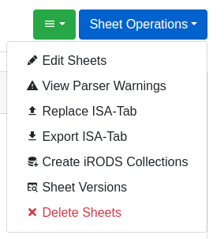
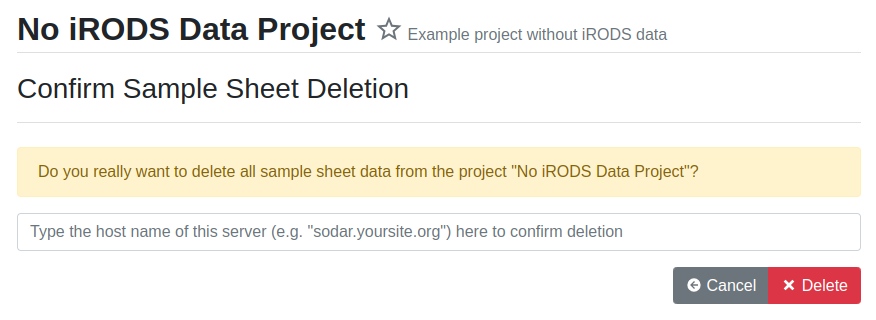
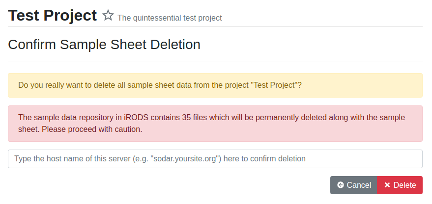

.. _app_samplesheets_delete:

Deleting Sample Sheets
^^^^^^^^^^^^^^^^^^^^^^

To delete sample sheets from a project, open the :guilabel:`Sheet Operations`
dropdown and select :guilabel:`Delete Sheets`. If iRODS collections have been
created for the project, this dropdown item will appear as
:guilabel:`Delete Sheets and Data`.

    Sheet Operations dropdown

Deletion Without iRODS Data
===========================

If no data has been uploaded into iRODS, the sample sheets can be deleted by any
project member with the role of contributor and above. You will be presented
with a confirmation form, in which you have to type the full host name of the
SODAR instance you are working on to initiate deletion.

    Sheet deletion confirmation form

.. warning::

    This action will delete the sample sheets, related display and editing
    configurations and possible previously saved versions. This action can not
    be undone!

Deletion With iRODS Data
========================

If files have been uploaded into the project sample data repository via landing
zones, deleting the sample sheets is only allowed for users with the owner or
delegate role. The confirmation form will present a warning regarding the
deletion of iRODS files along with the sample sheets.

    Sheet deletion confirmation form with iRODS data

If you have contributor access to a project and wish to delete the sheets when
data has been uploaded, you can either request an owner or delegate to handle
deletion, or submit :ref:`app_samplesheets_irods_delete` and delete the sheets
yourself after the requests have been accepted.

.. warning::

    In addition to deleting the sample sheets and saved versions, this action
    will also delete all project files from iRODS. This action can not be
    undone!
