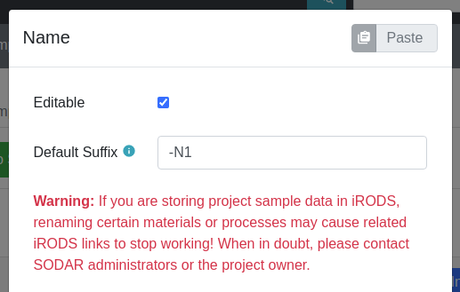

.. _app_samplesheets_edit:

Editing Sample Sheets
^^^^^^^^^^^^^^^^^^^^^

The Sample Sheets application allows editing the sample sheets within its UI.
Editing sample sheets is allowed for users with project contributor access or
higher. Changes are saved into the SODAR database and the edited version can be
exported as ISA-Tab TSV for use with other software. This section provides
guidance for sample sheet editing in the UI.

.. attention::

    Editing features are under construction. Not all features supported by the
    ISA-Tab model can yet be edited. Missing features are noted as such in
    this section.

Edit Mode
=========

To begin editing the sample sheets, open the :guilabel:`Sheet Operations`
dropdown and select :guilabel:`Edit Sheets`. This will reload the current
study and open it in edit mode, which differs somewhat from the default browsing
UI.

    Sample sheet UI in edit mode

Differences of edit mode:

- The navigation bar displays the edit mode status badge along with the version
  backup button.
- The Overview tab is disabled.
- The Sheet Operations dropdown is replaced by a *Finish Editing* button.
- An *Insert Row* button is added to the table header.
- Column headers contain buttons for configuring editing options for that
  specific column.
- Column cells are grayed out if editing the column is currently disabled.
- iRODS columns are hidden and replaced by a row edit column.
- Hyperlinks for e.g. ontology terms are not rendered in table cells.

    Editing status badge and navigation buttons

Cell Editing
============

To start editing the value of a cell, you can either double click it with the
mouse of press enter if you are navigating the table using a keyboard.

Changes to cells are saved immediately when committing the change with the enter
key or clicking outside of the cell. If the value is not valid for the column
configuration, the UI will inform you and allow correcting the value. You can
verify that changes have been saved by the :guilabel:`Changes Saved` text in the
edit mode status badge in the navigation UI.

It is possible for the user to toggle study table columns visible in assay
tables. In case of an edit to a cell which appears in multiple tables, the value
will automatically update in all tables.

The type of editing presented depends on the type of the column. Different
editing modes are detailed below.

Basic String or Numeric Input
-----------------------------

Editing a cell with a basic string, integer or numeric value allows you to enter
the value simply by typing in a standard spreadsheet fashion.

    String cell editing

Special syntax is available for basic string and/or numeric values:

Value as List
    You can enter a list of values by separating single values with the
    semicolon character (``;``). This works for both string and numeric columns.
Hyperlinks
    You can render the value as a hyperlink the following syntax:
    ``Link text <https://your.url>``. This is only allowed for string columns.

There are also special cases for string input and specific columns:

Node Names
    Node names are restricted to basic string editing with no list values or
    hyperlinks supported. Note that editing the name cell of an existing node
    will rename the existing node. Changing the row to contain a different
    existing node in case of splitting/pooling is not currently supported by the
    editor. If iRODS collections have been created, SODAR will check for
    existing files under the name of the material. If fles exist, the UI will
    alert the user and prompt for confirmation, in order to avoid generating
    orphaned files.
Contacts
    Contact cells act as string cells with the following expected syntax:
    ``Contact Name <contact@example.com>``. The email can be omitted. Multiple
    contacts can be provided using the semicolon character as a delimter. For
    example: ``Contact1 <c1.example.com>;Contact1 <c2.example.com>``.
Dates
    Date cells also provide standard string editing but enforce the ISO 8601
    ``YYYY-MM-DD`` syntax.

Numeric Input with Units
------------------------

Numeric columns associated with one or more units open up a popup editor, where
the unit can be selected along with the value itself. The default unit is
automatically selected.

    Unit cell editing

Option Selection
----------------

Certain columns may be configured to have the value selectable from a number of
acceptable options. For these you will see a standard dropdown for selecting the
correct value.

    Selection cell editing

Ontology Term
-------------

Editing an ontology term cell opens up a modal which enables you to search for
ontology terms and select one or more of them. The modal consists of ontology
search elements at the top and currently selected ontology term(s) on the
bottom.

One or more ontologies allowed for the column can be searched by keywords in the
top section. Search results appear in the selection box below. If multiple
ontologies are allowed for the column, you can restrict your search to a single
ontology as well as sort results grouped by ontology instead of ordering by
name.

If only one term is allowed for the column, any existing selection will be
overwritten. Otherwise the new selection will be appended to the list. Selected
ontology term entries can be sorted, edited or removed using the buttons on the
right of each ontology term.

Manual term entry is also possible by simply typing to the text boxes at the
bottom of the current entries and clicking the :guilabel:`Insert Ontology Term`
button.

Changes to the cell's ontology terms will be saved upon clicking the
:guilabel:`Update` button on the bottom right of the modal. You can also cancel
any changes by clicking the :guilabel:`Cancel` button.

The top right corner of the modal displays controls for copying and pasting
ontology terms between cells.

    Ontology term editing

External Links
--------------

Columns named *External Links* are a special case. The values are rendered as
badges, while editing is done with a standard string input expecting the
following syntax: ``id_type:id;id_type:id``

    External links cell editing

If configured on the server side for a specific key, the badges will link out to
the ID on the appropriate external web service. This has to be configured by an
administrator in a JSON file accessed via a path set in the
``SHEETS_EXTERNAL_LINK_PATH`` variable. For more information, see
:ref:`admin_settings`.

Row Editing
===========

The editor allows you to insert rows into study and assay tables, as well as
delete existing rows.

Row Insertion
-------------

To start inserting a new row into a table, click the :guilabel:`Insert Row`
button on the table card header.

    Insert row button

A new empty row will be inserted into the bottom of the table. You are expected
to fill out nodes from left to right. The next node to the right will become
available for editing once the previous one has been named.

    New unsaved row

Names of all nodes must be filled out before the row can be saved into the
database. Exceptions for this include unnamed processes, which will be
autofilled, as well as *File* type materials which can remain unnamed.
Characteristics, factor values and other metadata fields can be filled or left
empty at this point. Their values can be edited freely just like any other cell
after saving the row.

.. hint::

    The easiest way to fill up new nodes is to set default name suffixes for
    nodes which enable autofilling nodes. For more, see the
    *Column Configuration* section.

If you enter the name of an existing node in the same column for splitting or
booling, other cells of the node are autofilled match the existing "copies" of
the same node.

Once all the mandatory fields have been filled, the save button on the pinned
right hand side column becomes available. Clicking the button validates the
sample sheet and saves the row into the database. Alternatively, you can cancel
inserting the row using the cancel button.

    Row insertion cancel and save buttons

.. warning::

    Unlike regular cell edits which are saved instantly, newly inserted rows
    are **not** saved until the save button is clicked!

Some functionality is disabled while editing of an unsaved row is in process.
Saving the row or cancelling the operation will re-enable those features.

Inserting rows into asasy tables has one major difference to study tables: as
samples and preceeding nodes are expected to already be in the study table, you
first need to select an existing sample in the sample name column. This will
fill the cells up to sample, after which you can continue editing the remaining
nodes in the assay table. Saving and cancelling work similarly in both types of
tables.

    Sample selection when inserting an assay row

.. note::

    In the current implementation, you can insert one row into any table at a
    time. Multi-row insertion may be added in a future SODAR release.

.. attention::

    After inserting a row, you are unable to change a specific node to another
    existing one: changing the node name will simply rename the node. Switching
    between existing nodes for a row may be implemented in a further SODAR
    release. For now, you need to delete the row and insert a new one in case of
    e.g. accidentally selecting the wrong existing node.

Row Deletion
------------

A row can be deleted from a table by clicking the delete button on the pinned
right hand side column. The UI will request confirmation before deleting the
row.

    Row deletion buttons

.. warning::

    Deletion can currently **not** be undone without restoring a saved backup
    version of the entire sheets!

Study rows can only be deleted if the sample listed on a row is not included in
any of the study's assays. Deletion buttons for these rows are inactive in the
UI. If you wish to delete a study row, make sure to first delete rows containing
the corresponding sample from all assays.

In the current implementation, deleting all rows of a study or assay table is
not permitted. At least one row must remain in the table to ensure sample sheet
validity.

Column Editing
==============

.. attention::

    Inserting or removing columns to study and assay tables is not currently
    supported. This functionality will be added in a future SODAR release.

Investigation/Study Metadata Editing
====================================

.. attention::

    Editing investigation and study metadata or study protocols is not currently
    supported. This functionality will be added in a future SODAR release.

Adding and Removing Studies and Assays
======================================

.. attention::

    Adding or removing entire studies or assays is not currently supported. This
    functionality will be added in a future SODAR release.

Saving Backup Sheet Versions
============================

As has been described before in this section, changes are saved to the sample
sheets when cells are edited and rows inserted or deleted. The application also
enables saving backup versions of the entire ISA-Tab, which can be restored or
exported later.

There are two ways to save a backup version. Upon clicking the *Finish Editing*,
button, the current sheet version is automatically saved as a backup version if
changes have been made since entering the edit mode.

The user can also save a backup version manually by clicking the save button
next to the :guilabel:`Finish Editing` button. This opens a modal where you can
enter an optional description for the version for e.g. specifying which changes
were made and why.

    Version saving modal

For further details on browsing and managing backup sheet versions, see
:ref:`app_samplesheets_version`.

Column Configuration
====================

Edit mode in the Sample Sheets app allows configuring the column editing to
restrict values to e.g. a certain format, value options, integer range, used
ontology, etc. The configuration menu for each column is accessed via the
right-aligned button on the column header.

The required member role for configuring columns can be set in the
project settings under *Minimum role for column configuration editing*, the
default minimum role being project contributor.

Clicking the column configuration button opens a modal for setting configuration
variables. The modal content varies based on the column type, but all share a
few common elements:

- Configuration copy/paste elements in the top right corner
- The :guilabel:`Editable` checkbox for enabling or disabling editing for this
  column. This is disabled by default. When disabled, users are only able to
  enter data in mandatory fields such as material names or process protocols
  when inserting new rows.
- The :guilabel:`Cancel` and :guilabel:`Update` buttons for committing the
  configuration change or cancelling it.

Upon first importing or creating the sample sheets, the initial type and
configuration of a column is automatically determined by SODAR. The modal
controls for specific types of columns are detailed in the following
subsections.

.. attention::

    In the current implementation, there are limitations on changing the column
    type. Most notably, columns expecting ontology terms can not be changed to
    a basic string/numeric/selection column and vice versa. This functionality
    will be added in a future SODAR release.

String, Numeric and Selection Input
-----------------------------------

For characteristic and factor value columns with no ontology terms expected, you
are given the option to set the column values into string, integer, double or
selection. The type of column is selected under *Format*.

    Column configuration modal with select format

Different options for these value formats are as follows:

Regex
    Accepted value as regular expression for string and numeric values.
Default Value
    Default value for the cell when inserting new rows.
Default Fill
    If set true, all empty values in the column will be filled with the default
    value on configuration update.
Range
    For numeric columns, you can set a minimum-maximum range for accepted
    values.
Options
    For selection columns, valid options to choose from are listed here.

Numeric Columns with Unit
-------------------------

If unit columns are included for a charasterictic of a factor value in the
ISA-Tab, the UI allows setting unit selection for the column. In addition to
valid unit selections, you can select the default unit to be applied.

    Column configuration with unit

.. attention::

    In the current implementation, setting units as ontology terms is not
    supported. This functionality will be added in a future SODAR release.

.. _app_samplesheets_edit_ontology:

Ontology Terms
--------------

For columns which expect values as ontology terms, the column configuration
modal displays options for ontology setup. The ontologies up for selections are
those uploaded to the :ref:`Ontology Access <admin_ontologyaccess>` application
by SODAR administrators.

    Column configuration for ontology terms

Columns with certain names are autoconfigured by SODAR to accept specific
ontologies. These can still be reconfigured manually afterwards if needed.
Automated configuration includes the following columns: *HPO Terms*,
*OMIM Disease* and *Orphanet Disease*.

The following options are available for ontology term configuration:

Allow List
    If set true, multiple ontology terms can be listed in a single column.
Default Value
    Default term(s) can be pasted here from the ontology term edit modal as
    JSON.
Allowed Ontologies
    One or more ontologies allowed for this column. They can be reordered, which
    will affect the ordering of terms when searched.

Node Names
----------

Node names (apart from source) allow the definition of *Default Suffix*, which
incerements the previous node name with a specific suffix automatically. Setting
default suffixes for nodes speeds up the inserting of new rows into tables and
is highly recommended.

    Column configuration for node name

The source name column is a special case, where the UI only allows setting the
*Editable* value to true or false.

Process Protocols
-----------------

Protocol configuration enables you to set the default protocol applied to new
rows for the column. In most cases, only a single protocol is used for an entire
column. SODAR detects these types of protocol columns and automatically applies
the default protocol to new rows. Thus, in the most common case this
configuration does not have to be manually altered by the user when editing.

    Column configuration for protocol

.. attention::

    Editing and adding protocols for a study is not currently supported. This
    functionality will be added in a future SODAR release.

Contacts and Dates
------------------

These special column types only feature the *Editable* checkbox, with
instructions on the expected input format for cell values.

Update Sheet Cache
==================

In the Sample Sheets UI, iRODS links are activated and deactivated based on
whether files exist in collections to which the links are pointing. To reduce
the amount of iRODS queries and improve performance, information of existing
data is stored in a local SODAR cache.

For most actions such as landing zone operations, the cache is automatically
updated in the background. However, for some changes this might not occur. If
some links appear to be incorrectly enabled/disabled, you can manually update
the project cache based on current sample sheet data.

To do this, open the :guilabel:`Sheet Operations` dropdown and select
:guilabel:`Update Sheet Cache`. This will start the cache updating operation in
the background. You will receive an alert in the SODAR UI once this operation
has finished. Note that depending on the size of the sample sheets and the
number of associated files, this operation may take anything from a few seconds
to a few minutes.
