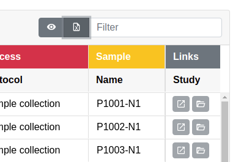

.. _app_samplesheets_export:

Exporting Sample Sheets
^^^^^^^^^^^^^^^^^^^^^^^

There are two methods of exporting sample sheets in the Sample Sheets app UI:
full export of the investigation as ISA-Tab and individual study or assay table
export as an Excel table. This section details both methods.

Export ISA-Tab
==============

To export the project sample sheets as ISA-Tabs, open the *Sheet Operations*
dropdown and click on *Export ISA-Tab*.

This exports the entire investigation with all studies and assays as a zip
archive containing all the ISA-Tab files as tab separated values (TSV). The
export is fully ISA-Tab compatible and can be used with other software
supporting the model.

Export Excel Table
==================

Individual study or assay tables can be exported as Excel compatible tables from
the Sample Sheets app UI. This is useful if one wants to e.g. easily access
certain columns for operations in spreadsheet software. Exporting a table is
done by clicking the export button on the right hand side of the table header.

    Sample sheet Excel table export button

.. warning::

    The data exported as an Excel table is **not** ISA-Tab compatible and it
    can't be used in place of an ISA-Tab TSV. Furthermore, some data may be
    rendered differently than in the actual ISA-Tab.
