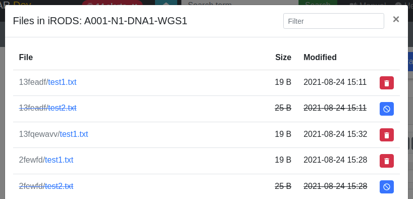
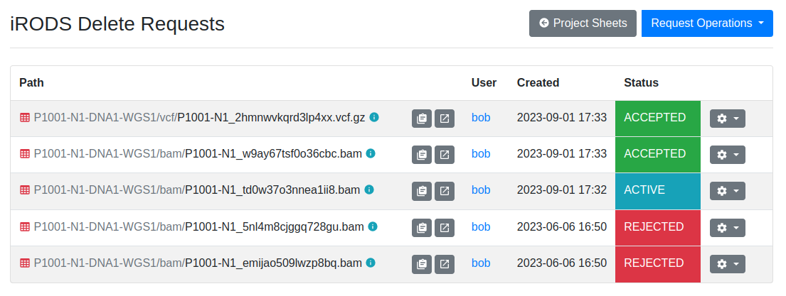
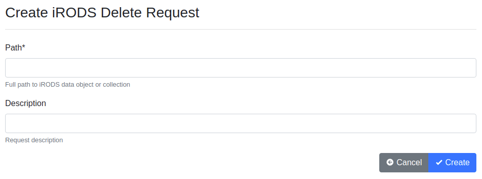
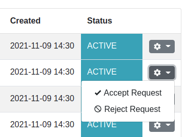

.. _app_samplesheets_irods_delete:

iRODS Delete Requests
^^^^^^^^^^^^^^^^^^^^^

The sample repository for each project is read-only and immutable. However,
there may be cases when e.g. wrong files or files are erroniously uploaded into
SODAR.

In order to delete files already in the sample data of a project, one has to
create an iRODS delete request for a file or a collection in iRODS. These
requests can be approved or rejected by a project owner or delegate. Once
approved, the file is deleted from iRODS. Creator of the request will receive
notifications of the accepting or rejecting action.

In this section we will go through the two different ways to create delete
requests, browsing these requests as well as accepting or rejecting them as a
project owner or delegate.

.. note::

    Project owners and delegates must also first create a request and then
    approve it in order to delete files. This has been done by design to avoid
    easy accidental deletions.

Issuing Requests in File List Modal
===================================

As briefly described in :ref:`app_samplesheets_browse`, requests for single
files can be issued or cancelled in the iRODS file list modal linked to assay
shortcuts and assay rows. Simply click the button on the rightmost column
to create a delete request. To cancel requests, click any button with the
blue colour and a canceling icon.

    iRODS file modal with delete request buttons

Browsing Delete Requests
========================

To see a list of your own delete requests as a contributor, or all active
requests in the project as a project owner or delegate, open the
:guilabel:`Sheet Operations` dropdown and select
:guilabel:`iRODS Delete Requests`.

    iRODS delete request list

The list provides a button for copying the iRODS path into the clipboard, status
information for the requests, WebDAV link as well as dropdowns allowing you to
either update or delete your requests. On the top of the page you can see a
*Request Operations* dropdown with *Create Request* link for manual creation of
delete requests.

Manual Request Creation
=======================

Clicking the :guilabel:`Create Request` button takes you to a simple form where
you can create a delete request by manually entering an iRODS path and an
optional description.

    iRODS delete request creation form

.. hint::

    The iRODS path in this form can point to either files or collections. If you
    need to request deletion of an entire collection, it should be done here.

Accepting and Rejecting Requests
================================

As project owner or delegate, you can accept or reject requests in the request
list view. The dropdown for each request provides you with the options of
accepting or rejecting a request. If accepted, the file or collection associated
will be deleted. If rejected, nothing is done to the files and the requesting
user will be informed of rejection.

    Request accepting and rejection options

.. warning::

    Accepting delete requests will delete the associated file(s) from iRODS with
    no possibility for undoing the action! Each request should be reviewed
    carefully.

Multiple Requests Accepting and Rejecting
=========================================

In addition to accepting or rejecting requests one by one, you can also accept
or reject multiple requests at once. This is done by selecting the requests you
want to accept or reject by clicking the checkboxes on the leftmost column of
the request list. Once you have selected the requests, click the
:guilabel:`Request Operations` dropdown and select either
:guilabel:`Accept Selected` or :guilabel:`Reject Selected`.

