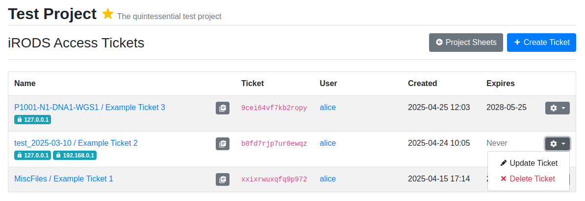

.. _app_samplesheets_irods_ticket:

iRODS Access Tickets
^^^^^^^^^^^^^^^^^^^^

The Sample Sheets application allows you to create anonymous iRODS access
tickets to specific collections in the sample data repository. This enables
providing publicly accessible URLs to these collections for e.g. integrating
data with other software.

.. warning::

    Anyone with the ticket or URL and network access to your iRODS server can
    access these collections, regardless of their project access! Care should be
    taken in what is shared publicly and to whom tickets are provided.

Currently, creating tickets is supported for setting up
`track hubs <https://genome.ucsc.edu/goldenpath/help/hgTrackHubHelp.html>`_ for
`UCSC Genome Browser <https://genome.ucsc.edu/>`_ integration.

You can create a track hub by uploading files under a collection under
``TrackHubs`` using Landing Zones. Thus, if you want to create a track hub named
``YourHub``, files should go under the collection ``TrackHubs/YourHub``. For
more information on landing zone uploads, see the Landing Zones documentation.

After the upload, your track hub should be visible in the assay shortcuts.

    Track hub in assay shortcuts

Once the track hub is available, you can create an access ticket for it in the
Sample Sheets app. Open *Sheet Operations* and click on *iRODS Access Tickets*
to open a list of access tickets for track hubs in the project. The anonymous
URL for each ticket can be copied to the clipboard using the button next to the
ticket label. In the right hand side dropdown for each ticket, you can either
update its details or delete it. Access is revoked for deleted tickets.

    iRODS access ticket list

To create a new ticket, click on *Create Ticket*. This opens a simple form where
you must choose the track hub path as well as set an optional ticket label and
expiry date. The label is for referencing the purpose of the ticket: tickets
with no label will be listed by their creation date. If no expiry date is set,
the ticket will be valid until manually revoked.

It is possible to create multiple tickets for a single track hub if there is
need to e.g. revoke access to ticket users at different times.

    iRODS access ticket creation form

A link to the WebDAV URL for the most recent valid access ticket is displayed in
assay shortcuts next to the existing assay, as displayed in the screenshot
below.

.. figure:: _static/app_samplesheets/irods_ticket_hub_link.png
    :align: center

    Track hub in assay shortcuts with ticket link

.. note::

    Currently SODAR only supports anonymous access tickets for track hub
    collections. This functionality may be expanded to other sample repository
    collections in a future SODAR release.
