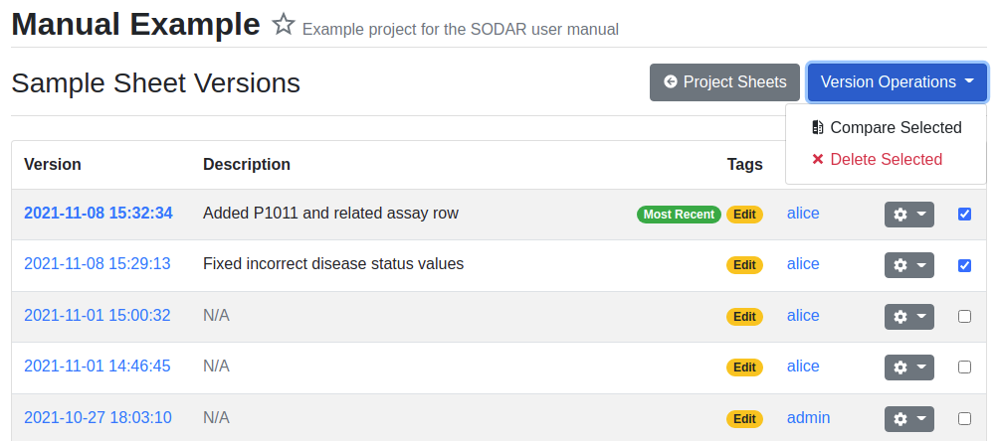
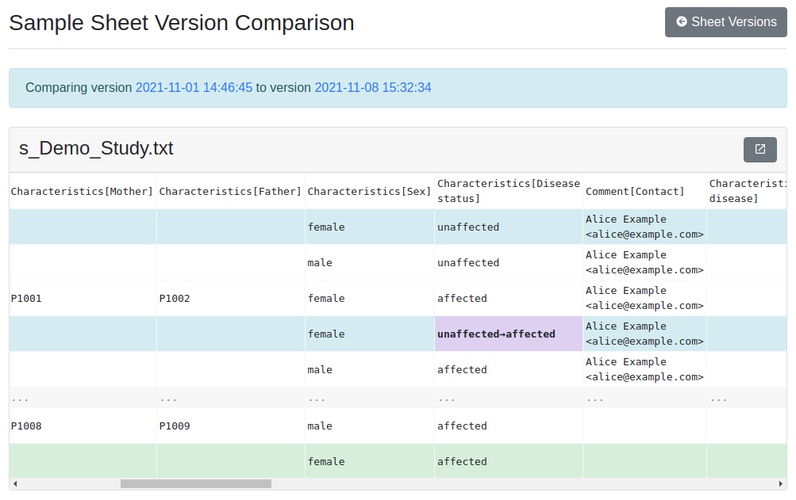

.. _app_samplesheets_version:

Sheet Version Management
^^^^^^^^^^^^^^^^^^^^^^^^

Saving backup versions of sample sheets was previously described in
:ref:`app_samplesheets_edit`. This section details the browsing and management
of the saved versions.

To access currently saved sheet versions, open the :guilabel:`Sheet Operations
dropdown and select :guilabel:`Sheet Versions`. You are directed to the version
list view which lists all the versions saved of the investigation currently in
the project with the most recent version on top.

    Sample sheet versions list

On the list you can see the versions listed by their name, which is in form of
a timestamp. The name also acts as a link for exporting the version as ISA-Tab.
If the version has been manually saved by a user, you can also see an optional
description of the version.

Tags are displayed for versions and include the following:

Most Recent
    The most recently updated version.
Import
    Version imported into SODAR from existing ISA-Tab files.
Edit
    Version edited within the Sample Sheets app of SODAR.
Restore
    Old version restored to replace active sheets in the project.

Accessible by project owner and delegates, there is a dropdown for each version
with the following options:

Update Description
    Update the version description.
Restore Version
    Replace the current active version of sample sheets with this version.
Delete Version
    Delete this version. This can not be undone.

To the right side of the list there are checkboxes for selecting multiple
versions for actions under the :guilabel:`Version Operations` dropdown. Once
exactly two versions are selected. the :guilabel:`Compare Versions` option
becomes selectable. Clicking this takes you to the version comparison page,
which displays the differences in included tables.

    Sample sheet versions list

To open a comparison table in a new "full screen" browser tab with no other
elements, click the icon in the top right corner of the table card.

Selecting any amount of versions in the version list enables the
:guilabel:`Delete Versions` option, which allows you to delete multiple backup
versions at once.
