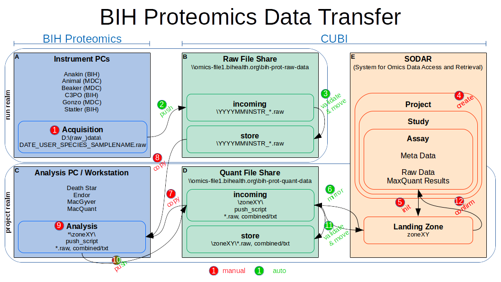
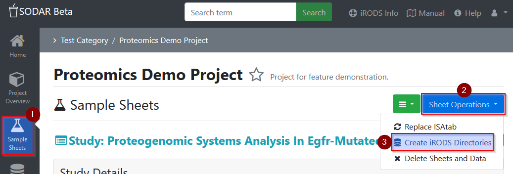
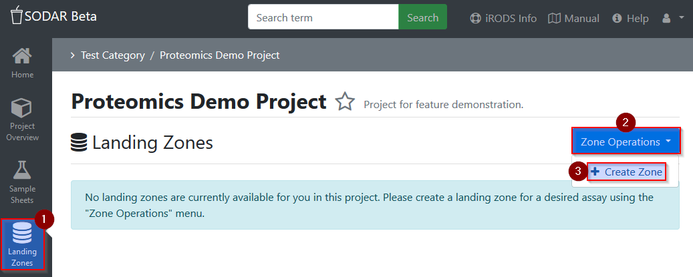
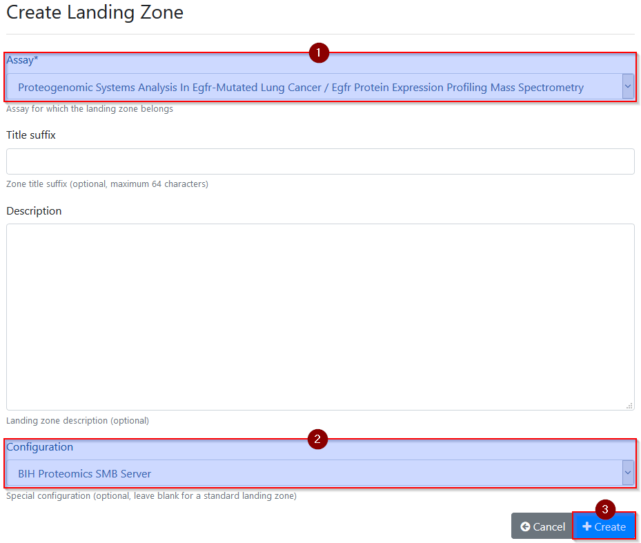
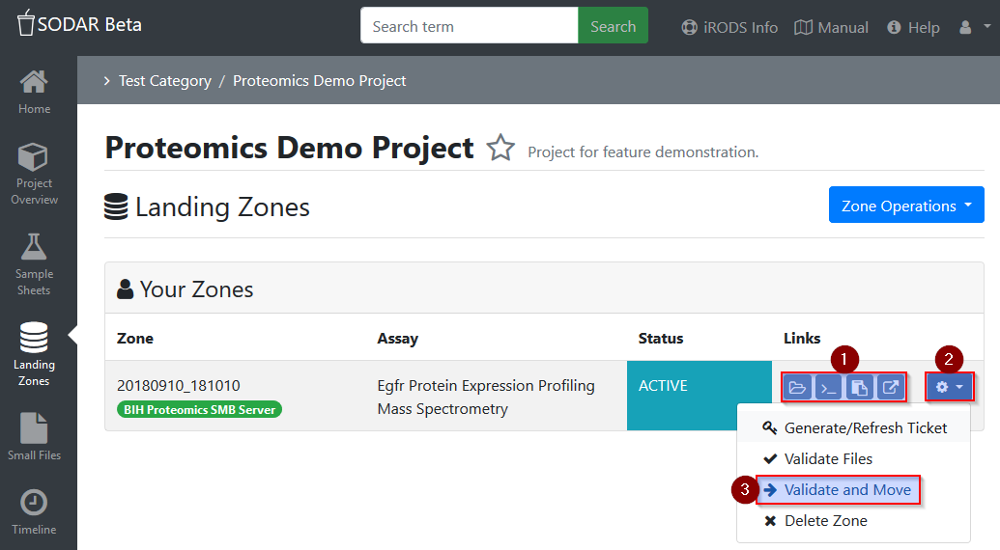

.. _data_transfer_bih_prot:

BIH Proteomics Data Transfer
^^^^^^^^^^^^^^^^^^^^^^^^^^^^

`QUICK REFERENCE CHART`_

The BIH Proteomics Data Transfer project aims to assist the transfer of MS data
from the BIH Proteomics core unit to BIH CUBI infrastructure, starting from
acquisition on the instrument computer, over first level analysis
(quantification by MaxQuant) on windows workstations up to the final
project-oriented storage in SODAR_ via landing zones.

This manual is focusing on the application by users. Deployment, installation
and execution of the automated parts of the workflow are described in the
corresponding `code repository`_ (restricted access).

.. _QUICK REFERENCE CHART: _static/data_transfer_bih_prot/bih_proteomics_data_transfer_quick_reference.pdf
.. _SODAR: https://sodar.bihealth.org
.. _code repository: https://cubi-gitlab.bihealth.org/CUBI_Engineering/CUBI_Data_Mgmt/omics_data_transfer_bih_prot_main

Workflow Overview
=================

The following figure gives a general overview over the data transfer workflow
and is referenced in the description below by the indicated numbers.

Raw Data Transfer (Instrument PCs)
==================================

Automated raw data transfer will be available for all Thermo MS instruments
used by the BIH Proteomics core unit. This includes BIH instruments
(Anakin, C3PO, Statler) as well as MDC instruments (Animal, Beaker, Gonzo).

The data transfer script is supposed to run continuously in background. On
initial startup, it maps the raw data share at
``\\omics-file1.bihealth.org\bih-prot-raw-data`` as net drive ``R:``. Then it
continously recognizes existing or newly acquired (1) raw data in
``D:\raw_data`` or ``D:\data`` (depending on the machine) and automatically
transfers it to ``R:\incoming`` (2). After validation on the server (3), the
raw data will be available in ``R:\store\``.

.. note::

	Raw files should be named according to the nomenclature suggested by the
	Selbach_ lab: ``YYYYMMDD_USER_SPECIES_SAMPLENAME.raw``. After transfer and
	validation, the files will be available in ``R:\store\`` as
	``YYYYMM\INSTR_YYYYMMDD_USER_SPECIES_SAMPLENAME.raw``, where the folder
	YYYYMM denotes the year and month of acquisition as extracted from the
	sample name	and INSTR denotes the instrument of origin.

.. _Selbach: https://selbachsrv.mdc-berlin.net/wiki/index.php/Sample_name_nomenclature

If the script is not running, it can be executed from desktop via
``BIH Proteomics raw data transfer``. If it is failing or not available at all,
please talk to `Mathias Kuhring`_.

As soon as the raw data is acquired and file names are known (including the
instrument prefix), it is recommended to create a project (4) in the SODAR
system (necessary at last after analysis). For now, talk to `Mathias Kuhring`_
to help you plan and set up up the SODAR project including the assay(s) you
need. He will then provide you with the necessary ISA-tab meta data csv
sheets (which can be filled out in Excel) and will assist in validation and
uploading.

After the project is setup in SODAR, the iRODS data storage has to be activated
for this project: In your SODAR project, go to ``Samples Sheets`` and in the
drop-down menu ``Sheet Operations`` select ``Create iRODS Directories``.

Project Data Transfer (Workstations)
====================================

Project data transfer (including raw data as well as quantification results,
currently by MaxQuant) should be available from all Windows workstations used
by the BIH Proteomics core unit (including Death Star, Endor, MacGyver and
MacQuant).

Permission for assay-specific data uploads to a SODAR project has to be granted
by creating a temporary landing zone (5) (similar to a dropbox): In your SODAR
project, go to ``Landing Zones``, then select ``Zone Operations`` and
``Create Zone``.

On the next page, select at least the assay to which data should be added as
well as the special configuration ``BIH Proteomics SMB Server`` before
activating the landing zone via the ``Create`` button. Only landing zones
with this configuration will be made accessible (6) via the dedicated BIH
Proteomics quant data share!

.. note::

	When creating landing zones, always select the special configuration
	``BIH Proteomics SMB Server`` to enable upload access from workstations.

If the quant data share is not available on a workstation yet, connect to the
share by mounting ``\\omics-file1.bihealth.org\bih-prot-quant-data`` as
network drive ``Q:`` (should only be necessary once, ask `Mathias Kuhring`_ for
the credentials).

Landing zones with proper configuration will become available in
``Q:\incoming\`` and include a push script to manually trigger data
transfer, consisting of the two files ``work_quant_data_transfer.bat`` and
``work_quant_data_transfer.ps1``. This script is tailored to target this
specific landing zone and will automatically handle md5 checksum creation
and validation to ensure data consistency. Copy the landing zone folder or
just the transfer script files to the workstation to enable project data
transfer (7).

Everything is now set up for transferring raw data and MaxQuant results to the
SODAR project resp. assay.

If not done already, copy the appropriate raw data from the raw data share to
the workstation (8). The raw data can be accessed by mapping
``\\omics-file1.bihealth.org\bih-prot-raw-data`` as net drive ``R:`` (should be
only necessary once, ask `Mathias Kuhring`_ for the credentials). When copying
raw data, make sure to include the corresponding checksum files
(``*.raw.md5``). They are vital to ensure file integrity over the whole
workflow and are checked and validated at several places.

.. note::

	Always copy raw files together with the corresponding md5 checksum file!

After MaxQuant analysis of the raw data (9) (optional), the transfer to the
SODAR project via the assay-specific landing zone can be activated by executing
``work_quant_data_transfer.bat`` (10) (simply double-click).

The push script will scan for data within the same folder and recognize and
upload ``*.raw`` files with valid md5 checksum files (``*.raw.md5``, as should
have been copied from the raw data share) and/or one or more MaxQuant result
folders. MaxQuant results folders (originally ``combined\txt\``) are only
accepted in the form of ``combined\YYYYMMDD_FREETEXT\`` and must include at
least the files ``summary.txt``, ``parameters.txt`` and ``mqpar.xml`` (last
one has to be moved there manually). This allows for adding several MaxQuant
analysis to the assay.

The push script will interactively list data and folder to be transferred as
well as to be rejected due to the criteria above and ask for confirmation to
continue.

After the script finished the transfer to the quant data share successfully,
the target folder will be locked. Depending on data volume, allow the server
some time to validate the data and move it to the actual SODAR landing zone
(11) as well as to ``Q:\store\`` (which only serves development and is not
intended for normal use, as it does only reflect transferred landing zones
but not the final state of SODAR project resp. assay data).

In SODAR, review the data arrived in the landing zone (12) (e.g. via the
icon-buttons for ``List files`` or ``Browse files in WebDAV``). Raw data is
automatically located in the directory ``RawData``, while MaxQuant results
can be found in ``MaxQuantResults`` (with the ``combined\`` parent removed).
Finally, the landing zone can be confirmed and moved to the long-term assay
storage by selecting the settings button (gear icon) and ``Validate and Move``.

The validation and moving process may fail, if data is corrupt (checksum
matching fails) or if files or folders with the same name are already
available for this assay. The corresponding folder on the quant data share
will be writable again to enable update (overwriting) or adding of data by
executing the push script again. In case anything needs to be removed from
the landing zone, consider connecting to the landing zone directly via
WebDav (see :ref:`ext_tool_winscp`).

In any case, it is always possible to start over by deleting the landing zone
completely in the SODAR project and creating a new one by following the same
steps again.

.. note::

	Landing zones can be created as often as needed, e.g. to upload raw data in
	batches or iterativly, or to add new MaxQuants results.

.. _Mathias Kuhring: mailto:mathias.kuhring@bihealth.de
