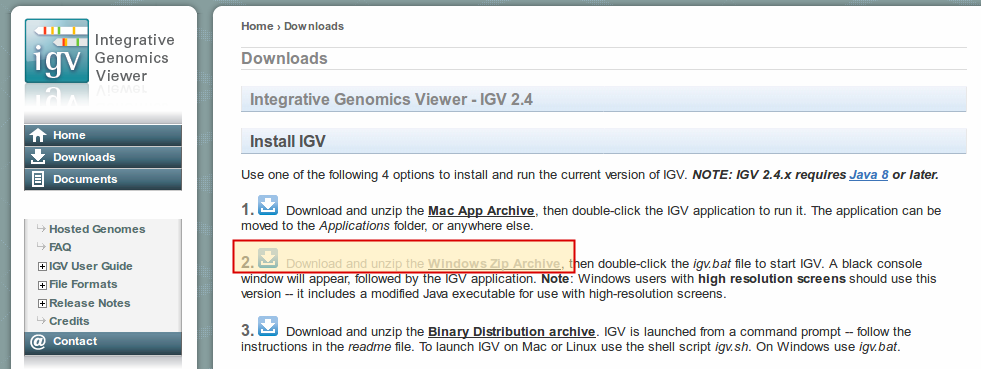

.. ext_tool_igv:

========================
IGV Installation & Setup
========================

This section documents the necessary steps for installation and setup of IGV for visualizing results of Omics experiments.

---------------
Downloading IGV
---------------

Download the ZIP archive with the IGV program for Windows.

1. Visit the download website

    - https://software.broadinstitute.org/software/igv/download

2. Click the underlined part of "Download and unzip the Windows Zip Archive"

3. Right-click on the downloaded ZIP file and extract it.
   You now have an installation of IGV that is bundled with the Java Runtime Environment.
   Because of U.S. export restrictions for encryption, strong encryption is not enabled.

4. For enabling strong encryption, you have to download "Java Cryptography Extension (JCE) Unlimited Strengh Jurisdiction Policy Files".
   Visit this website:

     - http://www.oracle.com/technetwork/java/javase/downloads/jce8-download-2133166.html

   Then, select "Accept License Agreement" and click 'n "jce_policy-8.zip".

    .. image:: _static/ext_tool_igv/Download_JCE.png

5. Now, extract this folder.
   You will find a folder ``UnlimitedJCEPolicyJDK8`` containing files name ``US_export_policy`` and ``local_policy`` (possibly with a ``.jar`` extension if Windows Explorer shows them to you).
   Select and copy both files.

6. Inside the extracted IGV folder, you will find a folder called ``jre-VERSION``.
   Inside, you will find a folder ``lib`` that contains a folder ``security``.
   This folder contains files named ``US_export_policy.jar`` and ``local_policy.jar`` as well and you have to overwrite them with the files from the JCE download from above.
   After completing this step, you now have a IGV installation that supports strong encryption (e.g., for loading files over the network).
7. **Move the final IGV directory to a folder on drive ``C:``**
    - This step is essential as for some reason, it will not work from network drives such as ``T:``.

-------------------
Proxy Configuration
-------------------

- Start the program by double-clicking on the ``igv.bat`` file.
- IGV will start and complain that it cannot download IGV files.
  You can ignore this for now.
- After the main window comes up, open the preference window by using the ``View`` Menu, then the ``Preferences`` menu item (see screenshot below).
- The preferences window will appear.
  Go to the ``Proxy`` Tab.
- Check the ``Use Proxy`` box.
- Enter the following values:
    - ``Proxy host``: ``proxy.charite.de``
    - ``Proxy port``: ``8080``
    - ``Whitelist``: ``cubi-omics-davrods-beta.bihealth.org``

.. image:: _static/ext_tool_igv/IGV_Proxy_Settings.png

------------------------------
"Remote Control" Configuration
------------------------------

IGV supports a "remote control" mode that allows you to load individual tracks or whole sessions directly into IGV from SODAR.
Technically, it runs an embedded HTTP server on ``localhost`` and clicking links redirecting there triggers commands.

To activate this, you have to go to the ``Advanced`` tab of the preferences, tick ``Enable port`` box and ensure the port is configured as ``60151``.

.. image:: _static/ext_tool_igv/IGV_Advanced_Settings.png
    :width: 75%
    :align: center

-----------
Restart IGV
-----------

- After restarting IGV, you should not see any more warning about genomes not being loaded.
