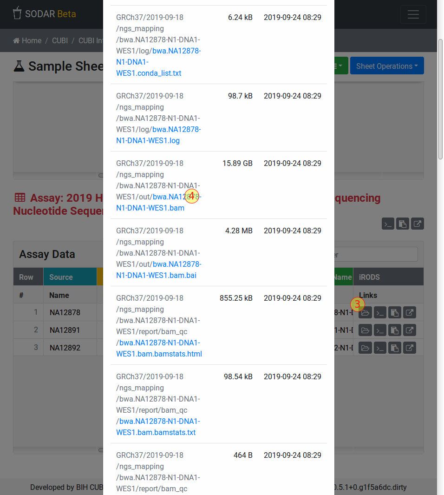

.. _ext_tool_igv_opening:

IGV Opening Session & Files
^^^^^^^^^^^^^^^^^^^^^^^^^^^

This section documents the necessary steps for opening IGV sessions and files
directly from SODAR.

The prerequisite is to have IGV open and configured to listen on port ``60151``
for "remote control" commands (see :ref:`ext_tool_igv_setup` for details).

Open IGV Session
================

To open a session directly in IGV, click on the the link icon next to the donor
in the "Study Data" table (labeled "1" in the following figure). Clicking this
window should activate your IGV window and you should have to enter your login
credentials (user name and password).

If you are using the BIH/Charite/MDC installation then you will have to enter
your Charite or MDC user name (in lower case) followed by either ``@CHARITE``
for Charite users or ``@MDC-BERLIN`` for MDC users. You have to use your
Charite/MDC password for login.

Clicking on the folder icon (labeled "2" in the figure above) opens a window
which displays download links and IGV session shortcuts for related files. This
window is depicted in the following figure.

The IGV session can be opened replacing the currently open session in IGV.
Another option is to merge the session into the currently open one with the
button displaying a plus icon.

BAM/CRAM and VCF files can be similarly loaded into the currently open IGV
session by clicking the corresponding button with a plus icon.

Obtaining File URLs
===================

You can also obtain URLs into the SODAR file serving sub system.

The donor or pedigree names in the IGV links window depicted above link directly
to the BAM/CRAM and VCF files in the file serving sub system. Right-click the
link and use the "copy link location" context menu entry to copy the File URL.

You can then open this link in IGV using the "File" > "Load from URL" command.
Paste the URL that you just copied into the "File URL" field of the window that
appears. You will have to use the same login instructions as in the "Open IGV
Session" section above.

Alternatively, you can go to the sample that you want to analyze in the "assay
data" table as shown in the figure below. Click the folder icon to see all files
associated with your sample (labeled "3" in the following figure). Scroll to the
file that you want to open (e.g., a file with the ``.bam`` extension).
Right-click on the path and copy the file's URL using the "copy link location"
context menu entry. You can then use this URL in the same way as described above
in this section.

