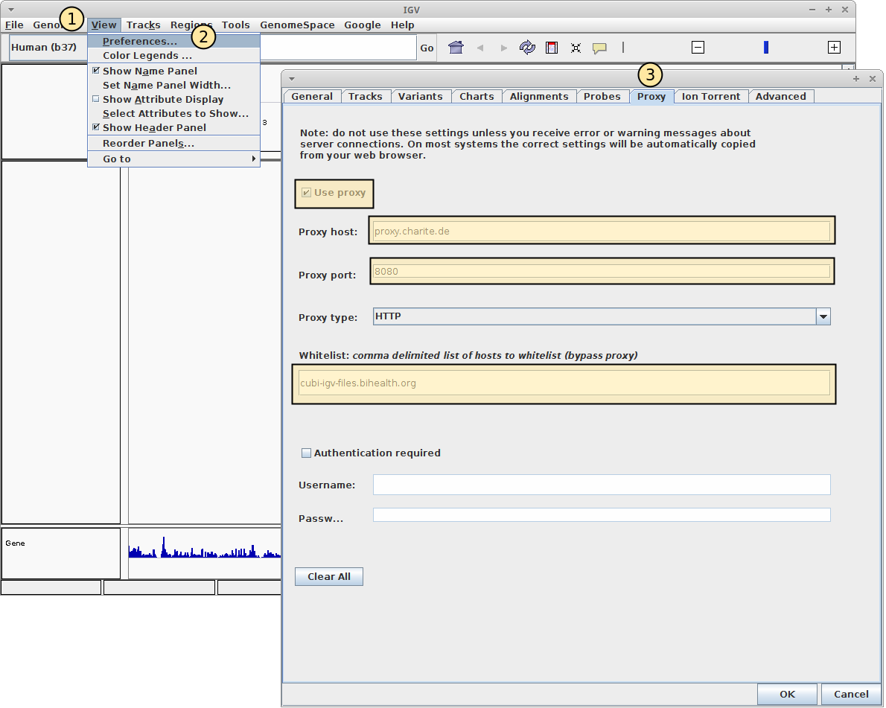
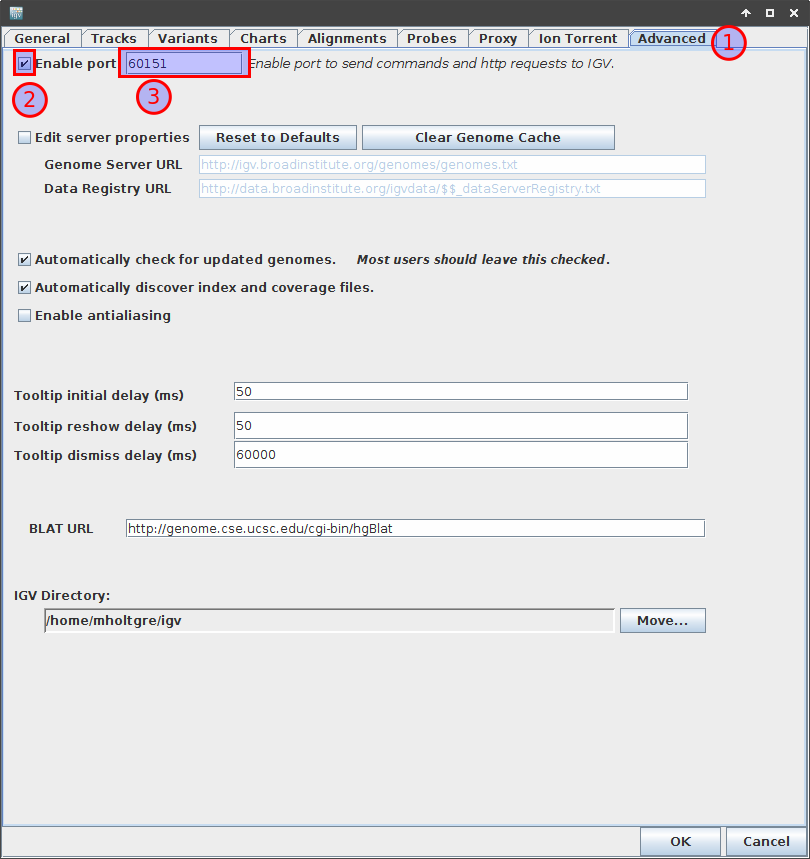

.. _ext_tool_igv:

IGV Installation & Setup
^^^^^^^^^^^^^^^^^^^^^^^^

This section documents the necessary steps for installation and setup of IGV for
visualizing results of Omics experiments.

.. note::

    The installation of IGV from the source site is a moving target because the
    homepage and download options keep changing. In particular, many Windows
    users in the clinic are not able to execute installer programs. Further, you
    will need to enable the "strong encryption" policy of Java. If you want to
    try this, please go ahead (below are the relevant links) but we cannot
    support you in this:

    - `IGV Download Page <http://www.oracle.com/technetwork/java/javase/downloads/jce8-download-2133166.html>`_
    - `Oracle Java Cryptography Extension <http://www.oracle.com/technetwork/java/javase/downloads/jce8-download-2133166.html>`_

Downloading and Installing IGV
==============================

Use the following link to download a standalone IGV version (including JRE and
strong encryption extension):

- `Standalone IGV <https://www.cubi.bihealth.org/files/IGV_2.3.97_Strong_Encryption.zip>`_

Extract the folder.

.. note::

    If you are in a hospital network, make sure that the final extraction target
    is on drive ``C:``. Otherwise, your computer's policy might prevent IGV from
    working properly.

Starting IGV
============

Start the program by double-clicking on the ``igv.bat`` file.

.. note::

    If IGV complains that it cannot download IGV files then you have to
    configure your proxy properly.

    See the section "Proxy Configuration" below for more details.

For good measure, visit `AmIBehindAProxy.com <http://amibehindaproxy.com/>`_ to
see whether you are behind a proxy. If you are not then you can skip the section
"Proxy Configuration".

Proxy Configuration
===================

Please visit `AmIBehindAProxy.com <http://amibehindaproxy.com/>`_ to see whether
you are behind a proxy. If you are not behind a proxy then you can skip this
section.

Otherwise, you have to find out your proxy host and port (e.g., from your IP
department). The instructions below use the configuration for the Charite
network as an example.

- Start IGV and ignore ("click away") the notification about the failed download.
- After the main window comes up, open the preference window by using the
  ``View`` Menu, then the ``Preferences`` menu item (see screenshot below).
- The preferences window will appear.
  Go to the ``Proxy`` Tab.
- Check the ``Use Proxy`` box.
- Enter the following values:
    - ``Proxy host``: ``proxy.charite.de``
    - ``Proxy port``: ``8080``
    - ``Whitelist``: ``cubi-omics-davrods-beta.bihealth.org,cubi-omics-beta.bihealth.org,sodar.bihealth.org,sodar-davrods.bihealth.org``

If you are outside of the Charite network then please ask your local SODAR
administrator for the values to put into the ``whitelist``.

"Remote Control" Configuration
==============================

IGV supports a "remote control" mode that allows you to load individual tracks
or whole sessions directly into IGV from SODAR. Technically, it runs an embedded
HTTP server on ``localhost`` and clicking links redirecting there triggers
commands.

To activate this, you have to go to the ``Advanced`` tab of the preferences,
tick ``Enable port`` box and ensure the port is configured as ``60151``.

Restart IGV
===========

- This is only necessary in the case that you had to configure the proxy.
- After restarting IGV, you should not see any more warning about genomes not
  being loaded.
