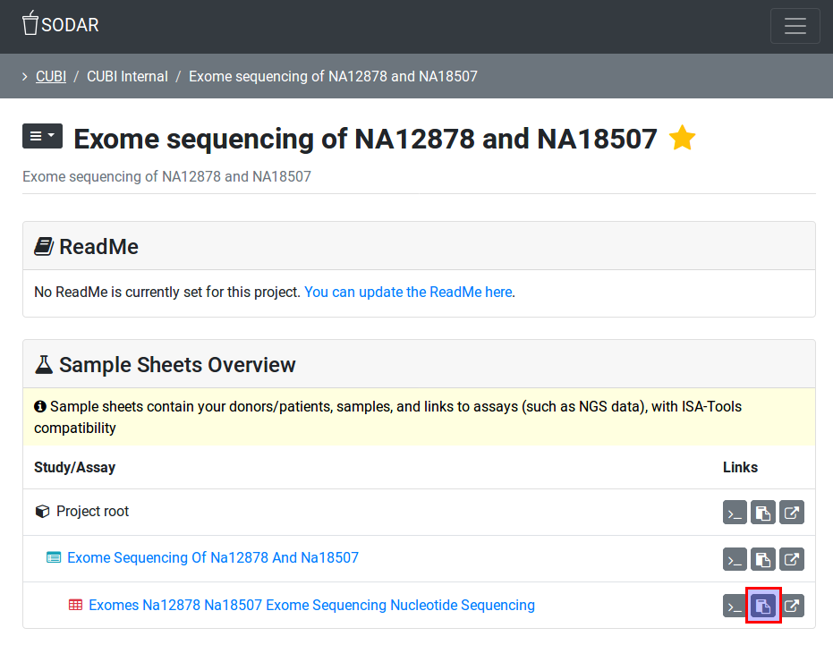

.. ext_tool_winscp:

===========================
WinSCP Installation & Setup
===========================

WinSCP is a Windows program that can be used to access the files in SODAR-FISS (SODAR File Access).
For this, files are served using the WebDAV protocol.
This section describes the installation and setup for accessing your files with WinSCP (with special note on Charite Workstations).

.. note::

    In general, it is also possible to access files and folders through WebDAV using the Windows Explorer.
    However, we discourage you from doing this as there are important limitations to Windows Explorer's support of WebDAV, e.g., you cannot access files larger than 4 GB.

----------------------------------
Prelude: Files in your Web Browser
----------------------------------

To just browse the files and downloading single files, you do not need to have any special program installed.

First, go to your project that has file access enabled.
You can theck this on the "Project Overview" page, the key "iRODS Repository" has to be set to "Available".

All files of your project are associated with assay results.
Thus, go to the "Sample Sheets" page of your project and scroll to the assay for which you want to access the files.
On the right side of the assay, you will see the column "Links".

These icons have the following meaning:

- Folder icon - display files within the SODAR page.
- ``>_`` - show iRODS command line to access sample data
- Link icon - Display the iRODS location in your browser.

Click on the "Link icon".
You will be taken to another server that displays the files in your sample in your web browser.
You will have to login again using your login ``user@CHARITE`` or ``user@MDC-BERLIN``.
You will see a listing similar to the following:

.. image:: _static/ext_tool_winscp/Browser_WebDAV.png

Below, we will refer to the **full URL/address** of the locations in the SODAR file access system.
You can get the address from this screen either from the address bar of your browser or by right-clicking on the the link after "Index of" and copying the link location into the clipboard.

-----------------
Installing WinSCP
-----------------

First, you have to download WinSCP.
This is most conveniently done by installing the "portable" version which you just have to unpack and you don't need to install.

1. Go to this website:

   - https://winscp.net/eng/downloads.php

2. Click on "Download" below "Portable Executable".

3. Next, extract the downloaded ZIP file and go into the folder created by unpacking the ZIP file.

    .. note::
        It is very important to download the data to drive ``C:\``, otherwise you will get connection and address resolution problems later!

4. Inside, you find a "WinSCP" program that you execute.

------------
Using WinSCP
------------

1. When you start the program for the first time, you will be greeted witha "Login" dialog.

    .. image:: _static/ext_tool_winscp/WinSCP_Login.png

    - Set "File Protocol" to "WebDAV"
    - Set "Encryption" to "TLS/SSL Implicit encryption"
    - Paste the full URL/address (see above) into "Host name"
    - Enter your user name into "User name"
    - Next, check that the correct path to the directory is used for connecting. Click "Advanced".

2. Select "Directories" and make sure that a path starting with ``/omicsZone/projects`` is shown in the "Remote directory" field.

    .. image:: _static/ext_tool_winscp/WinSCP_Directories.png

    - If this is not the case, use the path from the full URL/address after ``bihealth.org/`` (see above).
    - Click "OK".
    - Back in WinSCP login window, click "Login"

2. You can now browse the file from CUBI SODAR via WinSCP.

    .. image:: _static/ext_tool_winscp/WinSCP_Browser.png

You can drag and drop files outside the WinSCP window to copy them to any place of your liking on your workstation.
