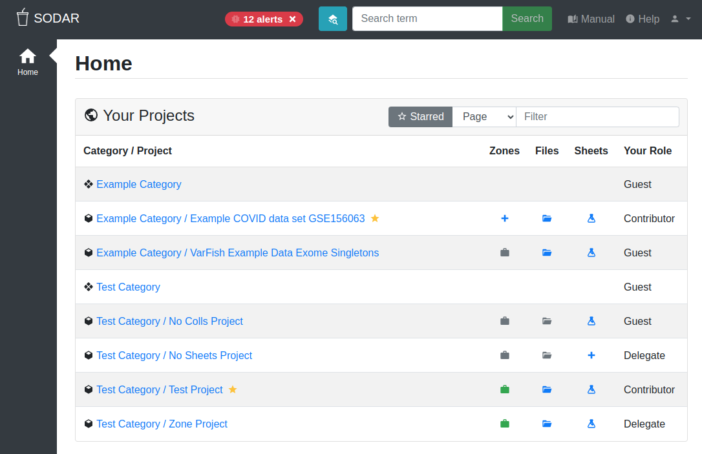

.. _manual-main:

SODAR Manual
^^^^^^^^^^^^

This is the manual for SODAR, the System for Omics Data Access and Retrieval.
The manual contains guides and reference information for the system's graphical
user interface, programmatic APIs and data modeling and ingestion conventions.
The manual is intended for users, administrators as well as developers of the
SODAR server software.

If you are new to SODAR, we recommend starting out with the
:ref:`Introduction <introduction>` section.

    SODAR home view

.. note::

    Certain sections in this documentation may refer to practices and SODAR
    configuration in use at specifically Berlin Institute of Health, Charité and
    MDC. If using a SODAR instance deployed within another organization, please
    refer to your organization's documentation regarding similar topics.

Table of Contents
^^^^^^^^^^^^^^^^^

.. toctree::
    :maxdepth: 2
    :caption: Contents:

.. toctree::
    :maxdepth: 2
    :caption: Introduction
    :name: sodar_intro

    introduction
    glossary

.. toctree::
    :maxdepth: 2
    :caption: User Interface
    :name: user_interface

    ui_index
    ui_login
    ui_user_dropdown
    ui_irods_info
    ui_api_tokens
    ui_user_profile
    ui_project_overview
    ui_project_timeline
    ui_project_members
    ui_project_update
    ui_alerts

.. toctree::
    :maxdepth: 2
    :caption: Sample Sheets
    :name: sample_sheets

    app_samplesheets
    app_samplesheets_browse
    app_samplesheets_create
    app_samplesheets_export
    app_samplesheets_edit
    app_samplesheets_version
    app_samplesheets_irods_ticket
    app_samplesheets_irods_delete
    app_samplesheets_sync

.. toctree::
    :maxdepth: 2
    :caption: Landing Zones
    :name: landing_zones

    app_landingzones
    app_landingzones_create
    app_landingzones_browse
    app_landingzones_transfer

.. toctree::
    :maxdepth: 1
    :caption: Data Transfer Guides
    :name: data_transfer

    data_transfer_irods
    data_transfer_bih_prot

.. toctree::
    :maxdepth: 2
    :caption: External Tools
    :name: external_tools
    :titlesonly:

    ext_tool_igv_setup
    ext_tool_igv_opening
    ext_tool_winscp

.. toctree::
    :maxdepth: 2
    :caption: Metadata
    :name: metadata

    metadata_recording
    metadata_advanced

.. toctree::
    :maxdepth: 1
    :caption: API Documentation
    :name: api_docs

    api_documentation
    Project Management API <api_projectroles>
    Sample Sheets API <api_samplesheets>
    Landing Zones API <api_landingzones>
    api_examples

.. toctree::
    :maxdepth: 1
    :caption: SODAR Administration
    :name: admin

    admin_overview
    admin_install
    admin_user
    admin_ui
    admin_ontologyaccess
    admin_commands
    admin_settings
    admin_custom

.. toctree::
    :maxdepth: 1
    :caption: SODAR Development
    :name: dev

    dev_overview
    contributing
    code_of_conduct
    dev_install
    Development Guidelines <dev_guide>
    dev_apps
    dev_resource

.. toctree::
    :maxdepth: 1
    :caption: SODAR History
    :name: sodar_history

    Release Notes <sodar_release_notes>
    Full Changelog <sodar_changelog>
