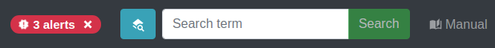
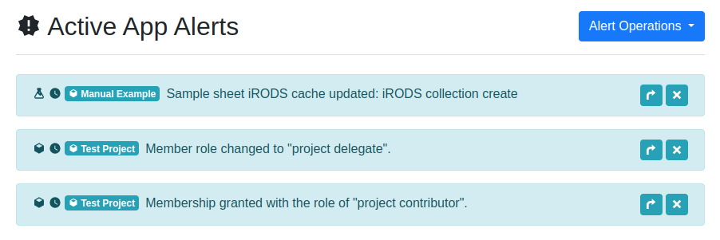

.. _ui_alerts:

Alerts
^^^^^^

This section details the types of alerts displayed for you and how to interact
with them.

Application Alerts
==================

The SODAR UI will display you alerts raised by its applications. These alerts
notify of e.g. activity affecting sample data, role changes in projects, status
of background jobs for landing zones, etc.

When logged in, you can see the red alert badge on the site title bar whenever
undismissed alerts exist. The badge displays the number of alerts along with a
close icon. Clicking the alert text will take you to the list of active alerts,
while clicking on the close icon will dismiss all the current alerts without
viewing them.

    Alert badge on the title bar

The "Active App Alerts" list will display your alerts in a chronological order
with the newest alert on top. The colour of the alert will define its type: blue
for information, green for a successful operation, yellow for a warning and red
for an error.

The left hand side of each alert displays an icon for the application raising
the alert as well as the alert timestamp. The name of the project is also
included for project-specific alerts. The project name links as the link to the
project overview page.

The right hand side of each alert contains one or two buttons. The arrow button
directs you to the project view related to the alert message before dismissing
the alert. The close button dismisses the alert and keeps you in the alert list
view.

On the top right corner of the view you can find the
:guilabel:`Alert Operations` dropdown. From the dropdown, you can select
:guilabel:`View Dismissed` to see your previously dismissed alerts, or
:guilabel:`Dismiss All` to dismiss all currently active alerts.

In addition to the alert badge, you can access the alert list by accessing the
user dropdown on the top right corner of the site and selecting
:guilabel:`App Alerts`.

    List of active app alerts

.. _ui_alerts_admin:

Administrator Alerts
====================

SODAR administrators can issue alert messages to all users. Admin alerts can
be used to inform users about e.g. upcoming downtime. These alerts are visible
as a permanent blue bar which can not be dismissed. Some alerts can contain
additional detailed information, which can be accessed by the
:guilabel:`Details` link. By default, administrator alerts are also sent out to
users as email.

    Admin alert
