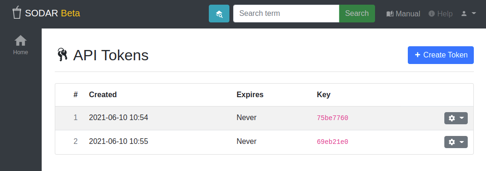

.. _ui_api_tokens:

API Token Management
^^^^^^^^^^^^^^^^^^^^

Through this application you can manage your SODAR API tokens. Tokens are useful
if you want to use software that interfaces with SODAR programatically, or if
you are developing one yourself.

    API token management

You can create API tokens with the :guilabel:`Create Token` button.

In the token list, you can see the time of creation, the expiry date, and the
first 8 characters of the key. Each token can be deleted via the dropdown on the
right hand side of the token list.

Please note that after creating the token, you will only be able to see the
first 8 characters again for reidentification. For security reasons, the token
itself will be encrypted using a one-way hash function. It is possible to check
a given token to be the same as in the database, but it is not possible to
retrieve a lost token. Rather, one would discard the old one from SODAR and just
create a new one.

Please also note that if you create and use an API token then, currently,
whoever bears your token has the same permissions to the SODAR system through
the API as your user. Allowing to limit scope is on the list of future features,
but currently this has not been implemented.

On creation, you can chose a number of hours that the token should be valid.
Using an expiry time of ``0`` will make the token permanently valid until
deletion.
