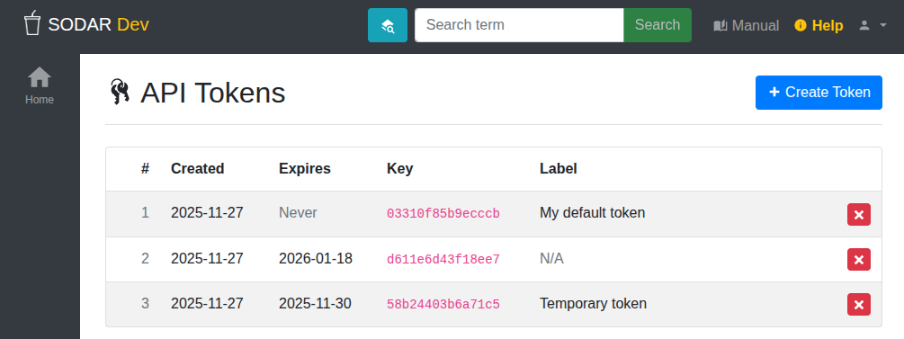
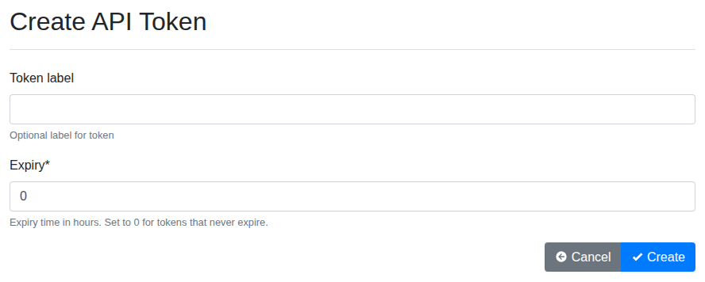
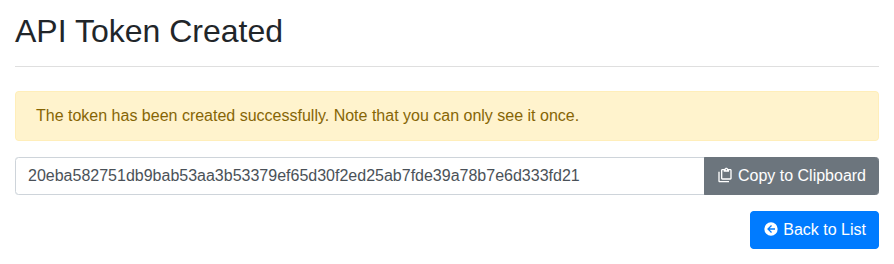

.. _ui_api_tokens:

API Token Management
^^^^^^^^^^^^^^^^^^^^

Through this application you can manage your SODAR API tokens. Tokens are used
for authentication with any software that interfaces with SODAR programatically
via the REST API. Additionally, if you are authenticating to SODAR via OIDC
single sign-on, API tokens are used in place of a password for connecting to
iRODS. API tokens are user specific, but one user can have more than one active
token at a time.

.. attention::

    When upgrading to SODAR v1.3 from an older version, pre-existing tokens will
    no longer work. All users must create new tokens. This is due to a
    breaking update in the token authentication library SODAR uses.

Token List
==========

Accessing the API Tokens application presents you with a list of your tokens.
For each token, the list displays the time of creation, the optional expiry
date, the optional text label and the first 8 characters of the key for
identification. Each token can be deleted via the corresponding delete button on
the rightmost column.

    API token list

Token Creation
==============

You can create API tokens by clicking the :guilabel:`Create Token` button. This
opens a form with two fields:

Token label
    Optional text label for the token. This will be displayed on the token list
    and helps you remember the purpose of the token, in case you want to e.g.
    create a specific token for a specific application. It has no other
    functional purpose.
Expiry
    Expiry time for the token in hours. Setting the value as ``0`` will
    make the token permanently valid until deletion.

    API token creation form

After token creation, the actual token string will be displayed to you on the
UI. Remember to copy and store your token string once generated, as it will only
be visible once. For security reasons, the token will be encrypted using a
one-way hash function. It is not possible to retrieve a lost token. If you lose
your token, you will have to create a new one.

    API token string copying

.. note::

    Whoever bears your token has the same permissions to SODAR as your user
    account. Make sure to keep your tokens safe and do not store them anywhere
    accessible by others. When in doubt, delete your tokens and create new ones.
