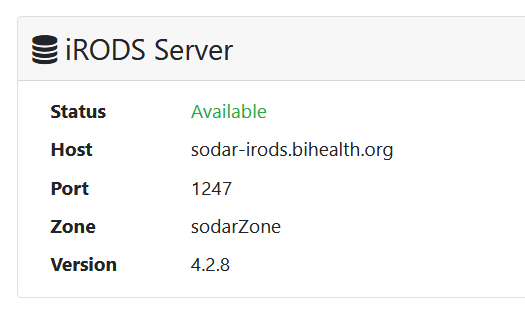

.. _ui_irods_status:

============
iRODS Status
============

This page displays detailed information on how to configure iRODS on your computer.
iRODS is the technology that performs the mass file data storage for SODAR.
Please note that this information is only applicable for Linux and Mac Os X where the iRODS icommands are available.

Also, this page displays the status and other information of the iRODS server.
You can use this information to verify that the iRODS file server is up and running in case of data access problems.

