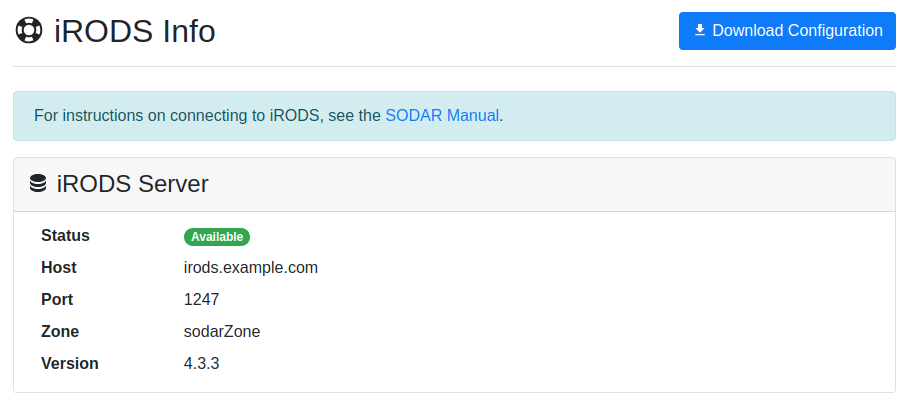

.. _ui_irods_info:

iRODS Info
^^^^^^^^^^

This view displays the status of the SODAR iRODS server.
`iRODS <https://irods.org>`_ is the system used for mass file data storage in
SODAR. You can use this information to verify that the iRODS file server is up
and running in case of data access problems.

    iRODS Info view with server status

In this view you can download your personal iRODS configuration by clicking the
:guilabel:`Download Configuration` button. This will return either an
``irods_environment.json`` file, or a Zip archive which contains the JSON file
and an accompanying server certificate file if one is needed in your
organization's SODAR environment. The file(s) should be placed in your
``~/.irods`` directory. See :ref:`data_transfer_irods` for more information on
connecting to iRODS and data transfers.

Upon your initial SODAR login, an iRODS user account will also be created for
you with the same user name and password you use to access SODAR. However, to
access any project data in iRODS you will need to be explicitly granted project
access in SODAR.

.. include:: _include/oidc_irods_token.rst
