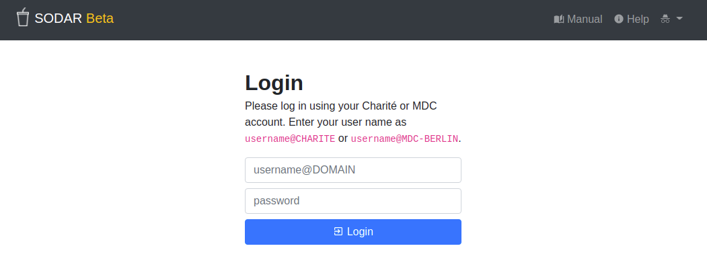

.. _ui_login:

Login View
^^^^^^^^^^

The login view presents a simple form for logging into the system.

    SODAR login view

When connecting to SODAR with your organization's account, use your usual user
name followed by ``@DOMAIN`` of your home organization and your password. For
example, for the SODAR instance at BIH, you are expected to use ``@CHARITE`` or
``@MDC-BERLIN`` in your user name.

If the site has single sign-on enabled, you can find a button for the single
sign-on provider below the regular login form. By default this button is labeled
:guilabel:`Single Sign-On Login`, but it button may look different depending on
the service used. Clicking on the button will take you to the single sign-on
service used at your organization, where you will be prompted to provide your
login credentials. After a successful login you will be redirected back to
SODAR.
