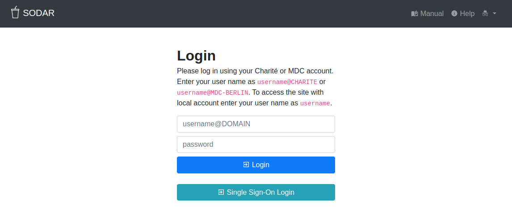

.. _ui_login:

Login View
^^^^^^^^^^

The login view presents a simple form for logging into the system.

    SODAR login view

When connected to multiple authentication sources, use your usual user name
followed by ``@DOMAIN`` of your home organization and your password in your
organization. For example, at BIH, you are expected to use ``@CHARITE`` or
``@MDC-BERLIN``.

At other sites, your administrator should have setup an appropriate messages
such as the one for BIH that you see above.

If enabled, you can also see a separate button for single sign-on. Clicking this
button will take you to the single sign-on service used at your organization,
where you will be prompted to provide your credentials.
