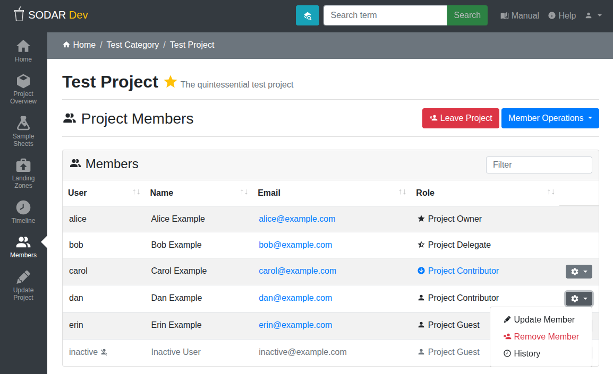

.. _ui_project_members:

Project Members
^^^^^^^^^^^^^^^

The member view displays the roles currently assigned to users within a
project or a category. These roles control the access to project data and SODAR
functions. Users with sufficient access can also add, update and remove roles
through this view.

    Project members view

Member Roles
============

In SODAR, a single *role* at a time can be assigned to a user within a category
or a project. Role assignment works similarly between categories and projects
except for special cases we will be detailed. With the exception of these
special cases, "project" will be used to refer to either a category or a
project.

The following types of roles are available, ordered by descending
level of rights and functionality within each project:

Project Owner
    Full access to project data and functionality. Ability to assign roles,
    including delegates. Can transfer ownership to another user.
Project Delegate
    Full access to project data and functionality, with the exception of
    modifying owner or delegate roles. This role can only be assigned by a
    project owner.
Project Contributor
    User with access to create and modify data within a project. This includes
    e.g. uploading files and editing sample sheets, with some limitations. For
    example, modifying project metadata or user roles is not allowed.
Project Guest
    Read-only access to project data.
Project Finder
    A role assignable only to users in categories. A user with a finder role can
    see child categories and projects along with their member lists without
    gaining access to project data or project apps. This is usable for e.g.
    members of staff in the organization maintaining the SODAR instance or a
    specific category structure. This role allows them to see which categories
    and projects exists and who manages them, in order to have a full picture of
    the category and project structure. Actual project access can then be
    requested from a project owner or delegate.

Role Inheritance
================

Roles are inherited from parent categories. A role inherited from a parent
category can be promoted for the current category or project. The promoted role
is then also inherited by child projects in case of a category. Demoting
inherited roles is not allowed. Inherited roles are marked in the member list
with a downwards arrow along with a link to the category from which the role is
inherited.

Each project must have exactly one "local" (non-inherited) owner. The amount of
allowed delegates is set by the server administrators. The number of inherited
owners and delegates are not limited. For contributors and guests, the amount
per project or category is not limited.

    Inherited member role

Adding Members
==============

Users with an owner or delegate role are able to add and update project member
roles. To add a SODAR user as a member, open the :guilabel:`Member Operations`
dropdown and select :guilabel:`Add Member`.

.. figure:: _static/sodar_ui/project_members_dropdown.png
    :align: center
    :scale: 80%

    Member operations dropdown

You are presented with a form to select a user and a role for them. The user
field works as a search box, where you can start typing a person's name or email
address and available options will be presented as you type. If the user is not
yet a SODAR user, you can also type an email address and be redirected to the
member invitation form. Deactivated users will not appear in the search.

.. figure:: _static/sodar_ui/project_members_add.png
    :align: center
    :scale: 65%

    Member adding form

If email sending is enabled on the SODAR server, an email notification is sent
to the user being added into the project. You can preview this email by clicking
the :guilabel:`Preview` button. To assign the role, click the :guilabel:`Add`
button.

Updating Members
================

If you want to update the role of an existing member, open the dropdown next to
the user in the member list and click :guilabel:`Update Member`. You will be
presented with a form to change the user role. Similarly, if you want to remove
the membership from a user, you can click :guilabel:`Remove Member`.

.. figure:: _static/sodar_ui/project_members_update.png
    :align: center
    :scale: 80%

    Member update dropdown

In case of an inherited member, you can see the :guilabel:`Promote Member`
option instead of the regular updating link. As described before, inherited
members can only be promoted to a higher role. The link opens a form similar to
user updating, only allowing you to select a role of higher rank than the
current inherited one. If you wish to demote an inherited user or remove their
access entirely, you should follow the inherited category link in the member
list and remove the role from a parent category.

    Member promote dropdown

Modifying the project owner works slightly differently. In the dropdown next to
the owner in the member list, you will see a :guilabel:`Transfer Ownership`
option. This will present you a form where you can select a new owner from the
current project members as well as select a new role for the current owner. If
the old owner's role is set to "remove role", they will be removed from the
category or project. The ownership tranfer functionality is only available for
users currently set as the project owner.

.. figure:: _static/sodar_ui/project_members_owner.png
    :align: center
    :scale: 80%

    Owner update dropdown

These dropdowns also contain a :guilabel:`History` link, which will take you to
the :ref:`Timeline <ui_project_timeline>` application to view the history of the
user's membership in this project.

Inviting Members
================

If a user has never before logged in to SODAR, you can send them a project
invitation by email. For this, open the :guilabel:`Member Operations` dropdown
and select :guilabel:`Send Invites`. Alternatively, you can enter an email
address in the add member view as described above.

This presents you a form where you can add the user email, project role and an
optional message displayed in the invitation email. You can preview the email by
clicking the :guilabel:`Preview` and send it by clicking :guilabel:`Send`.

    Member invite form

You will receive a notification for the user accepting the invitation. To view
your existing invitations, navigate to the member list, open the
:guilabel:`Member Operations` dropdown and select :guilabel:`View Invites`. Note
that invitations will expire after a certain time specified by SODAR
administrators.

Leaving a Project
=================

To leave a project, click the :guilabel:`Leave Project` button, or the
corresponding :guilabel:`Leave Category` button for a category. This will remove
your access to the project in SODAR and iRODS.

If you have inherited roles in any child categories or projects, access to them
will also be removed unless they have been promoted to a higher level local role
within any of those children.

An owner can not leave a project directly. Instead, you will need to click
:guilabel:`Transfer Ownership` and assign the owner role to another user.

.. note::

    Once you have left a category or project, you can not rejoin in unless an
    owner or a delegate grants you a new role.
