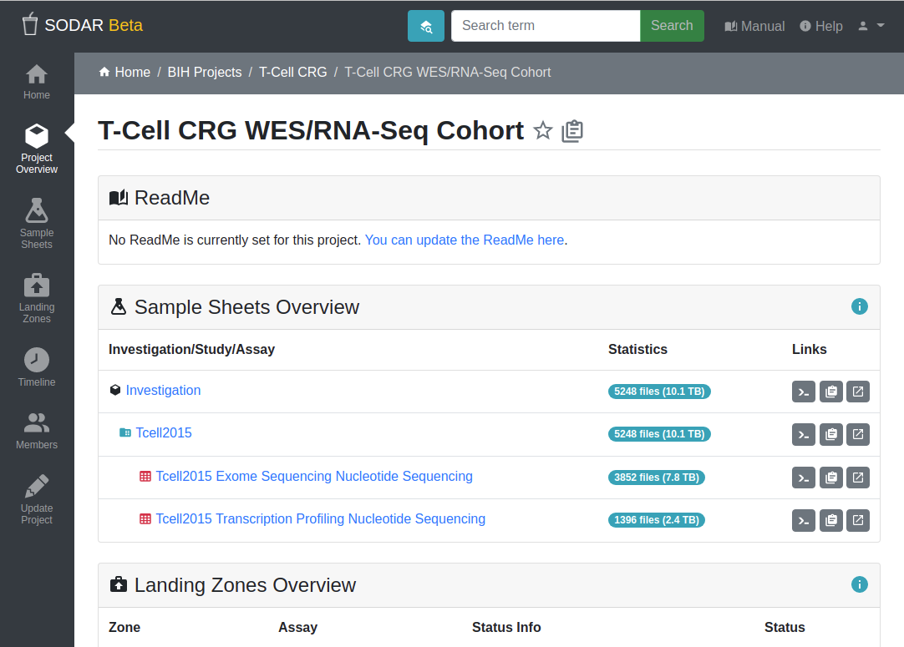

.. _ui_project_overview:

Project Overview
^^^^^^^^^^^^^^^^

Once you navigate into a project, you can see the project overview on the right
hand side of the screen. The sidebar on the left hand side has been expanded to
display links related to the project.

Furthermore, you can see a navigation breadcrumb for quickly returning to a
parent category, as well as the project title bar displaying the project title,
description and some general links.

    Project overview

If you are viewing a category instead of a project, you will see a more limited
set of information and sidebar links, while still following the same general
structure.

Project Overview
================

The project overview consists of the following sections:

ReadMe
    An optional description for the project in MarkDown notation. Can be updated
    :ref:`project update view <ui_project_update>` by users with an *owner* or
    *delegate* role.
Sample Sheets Overview
    Lists the investigation, studies and assays in the project's
    :ref:`sample sheets <app_samplesheets>`. Along with file statistics you can
    see link buttons that allow you to:

    - copy the corresponding iRODS path to the clipboard,
    - copy the WebDAV URL to the clipboard, or
    - directly link into the WebDAV URL for browsing the files.
Landing Zones Overview
    Displays the five most recently created
    :ref:`landing zones <app_landingzones>`.
Timeline Overview
    Displays the five most recent events taken in the project. Your project role
    define the events that you can see.

Sidebar
=======

The sidebar can contain the following links, depending on your access level in
the project:

:ref:`Home <ui_index>`
    Return to the home view.
:ref:`ui_project_overview`
    Return to the project overview page.
:ref:`Sample Sheets <app_samplesheets>`
    Open the Sample Sheets application.
:ref:`Landing Zones <app_landingzones>`
    Open the Landing Zones application.
:ref:`Timeline <ui_project_timeline>`
    Open the Timeline application.
:ref:`Members <ui_project_members>`
    Enter the project members view. This view allows you to see the members with
    access to this project. If you have a project owner or delegate role, you
    can modify project membership roles here.
:ref:`Update Project <ui_project_update>`
    Allows updating project details and settings. Available to project owners
    and delegates.
:ref:`Create Project or Category <ui_project_update>` (for Categories)
    If you are viewing the overview for a category and have owner, delegate or
    contributor access, you will also see a link for creating a new category or
    project under the current category.
