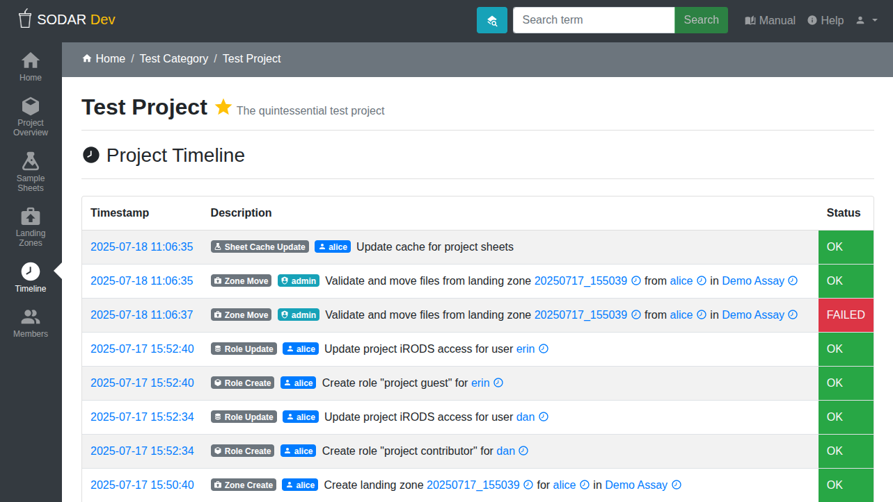

.. _ui_project_timeline:

Project Timeline
^^^^^^^^^^^^^^^^

The *Timeline* application displays a detailed log of activity in the project.
This includes e.g. member role assignments, file transfers from landing zones,
and changes to the sample sheets. The activity is displayed as a list of events.

    Project timeline

For each event the following details are available:

Timestamp
    Time of the event's creation. This doubles as a link to a popup which
    displays the event status history. This can be useful information e.g. in
    case of asynchronous background events.
App
    SODAR application in which the event was created.
Event
    Type of the event.
User
    User initiating the event.
Description
    Description of the event. Objects included in the description have a link
    displayed as a clock notation. Clicking this opens a list of all events
    related to the object. The title of the object also often works as a link
    to the related application. Possible extra JSON data is displayed as a link
    in the right hand side of the field. The link opens a modal displaying the
    JSON data.
Status
    Current status of the event.

For viewing site-wide events not related to any specific project, open the
:ref:`ui_user_dropdown` and click :guilabel:`Site-Wide Events`.
