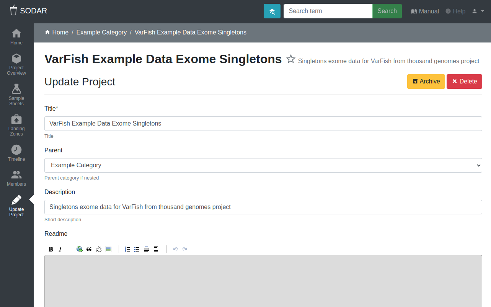

.. _ui_project_update:

Project Creation and Update
^^^^^^^^^^^^^^^^^^^^^^^^^^^

The project creation and update view allows you to create a project or category,
or update existing project metadata and settings.

For creating new categories or projects, you must have the role of either owner,
delegate or contributor in the parent category. For updating an existing
project, the role of owner or delegate is required.

    Project creation and update view

Project Metadata
================

The following project metadata and settings are available for updating:

Title
    Update the project title. The title must be unique within the parent
    category.
Parent
    Move the project to another category. Options only contain categories for
    which you have sufficient access.
Description
    Set an optional longer description of the project.
ReadMe
    Set an optional ReadMe document with for the project. MarkDown notation can
    be used.
Public guest access
    Enable public guest access to the project for anyone using SODAR. This
    should be used with caution and is generally intended for demonstration
    projects. If your SODAR server allows anonymous users, this will grant guest
    access to anyone browsing the site.
Enable project on {target remote site}
    Enable access to project for project members on the selected target site.
    Target sites for which project owner/delegation modifying is enabled by an
    administrator are listed here. Deselecting a previously selected site will
    revoke access on the target site. For more information, see
    `Remote Site Access documentation <https://sodar-core.readthedocs.io/en/latest/app_projectroles_usage.html#remote-projects>`_.
Notify members of landing zone uploads
    Send project members email updates for file uploads using landing zones. For
    more information, see the
    :ref:`Landing Zones app documentation <app_landingzones>`.
Prohibited file types
    If you want to prohibit uploading files of certain types to the project,
    add related file suffixes here as a comma-separated list. The file suffixes
    will be checked during landing zone validation. For more information, see
    :ref:`app_landingzones_transfer_prohibit`.
Allow sample sheet editing
    Enable or disable editability of sample sheets in the project.
Enable sheet synchronization
    Enable sample sheet synchronization. For more information, see
    :ref:`app_samplesheets_sync`.
URL for sheet synchronization
    REST API URL of remote project for sample sheet synchronization.
Token for sheet synchronization
    Token string for sample sheet synchronization.
IGV session genome
    Genome used in generating IGV session files for the project. The name needs
    to be in a format accepted by IGV. Affects cancer and germline projects.
BAM and CRAM paths to omit from IGV sessions
    Comma-separated list of iRODS path glob patterns for omitting BAM and CRAM
    files from IGV sessions and study shortcuts. Overrides site-wide setting,
    affects cancer and germline projects. You can input paths to subcollections
    under project sample data as well as file names. Using wildcards like ``*``
    and ``?`` is permitted. Providing full iRODS paths is not necessary: each
    pattern is assumed to start with a ``*`` wildcard. An empty setting means no
    files or collections are excluded. You need to run
    :guilabel:`Update Sheet Cache` in the Sample Sheet application for changes
    to take effect.
VCF paths to omit from IGV sessions
    Comma-separated list of iRODS path glob patterns for omitting VCF files from
    IGV sessions and study shortcuts. Overrides site-wide setting, affects
    cancer and germline projects. Behaves similarly to the related BAM/CRAM
    setting. You need to run :guilabel:`Update Sheet Cache` in the Sample Sheet
    application for changes to take effect.
IP restrict
    Restrict project access to specific IP addresses if this is set.
IP allow list
    List of accepted IP addresses for the IP Restrict setting.

When creating a new project, the following fields are included:

Type
    Project type. This can either be *Project* or *Category*. The type can not
    be altered after the project has been created.
Owner
    The user who will be set as project owner. After creation, the role can be
    reassigned in the Members view.

.. note::

    After modifying any fields, make sure to click the :guilabel:`Update` button
    to apply the changes.

Project Archiving
=================

From the :guilabel:`Archive` button in the top right corner of the view, it is
possible to archive or unarchive a project. This will set the project data into
a read-only mode for all users, including owners and delegates. The

- Sample sheets can no longer be edited.
- Restoring of sample sheet versions is disabled.
- No iRODS requests for deleting sample data from iRODS can be added.
- No new data from landing zones can be uploaded into the sample data
  repository.

Some editing functionality will remain active when a project is archived:

- Project metadata such as readme and description can still be modified.
- iRODS access tickets for sample sheets can be modified.
- Sample sheet cache can be updated.
- Existing landing zones can be accessed and deleted.
- User membership can be altered, but only read-only access is granted while the
  project is archived.

Unarchiving the project will restore write access to data according to current
member roles.
:guilabel:`Unarchive`.

.. note::

    Archiving categories is not currently supported.

Project Deletion
================

A category or a project can be deleted by clicking the :guilabel:`Delete`
button. This takes you to a confirmation view where you must input the host name
of your SODAR instance to proceed.

Cascading deletion is not supported. In order to delete a category with child
categories or projects, the children need to be individually deleted. This is
done to prevent accidental data loss.

Deleting a project will also delete its :ref:`Timeline <ui_project_timeline>`
events. Deletion creates a summary Timeline event, which is viewable by
superusers in the :guilabel:`Site-Wide Events` view.

.. danger::

    Deleting a project will delete all of its data including sample sheets,
    iRODS sample data and landing zones. This operation can **not** be undone!
