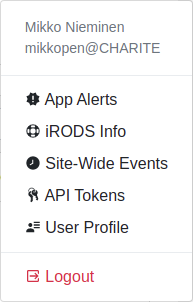

.. _ui_user_menu:

=========
User Menu
=========

The user / profile menu gives access to site-wide pages/views (called site-wide apps).
Currently, the following ones are accessible, also see the picture below.

User Name
    Displays back the name of the currently logged in user and the account name.
iRODS info
    Show the :ref:`ui_irods_status` information on how to connect to iRODS (the file storage that is backing SODAR).
API Tokens
    :ref:`Manage API (application programmableinterface) tokens <ui_api_tokens>` for programmers.
User Profile
    Configure your settings in the :ref:`User Profile <ui_user_profile>` view.
Log Out
    Log out of SODAR and redirect to the :ref:`login screen <ui_login>`.