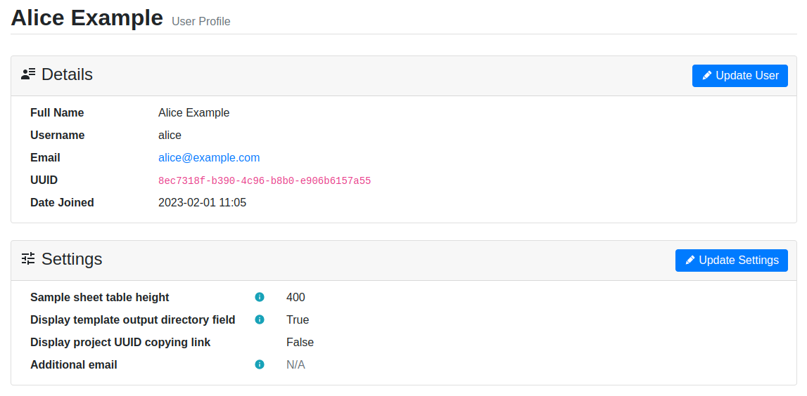

.. _ui_user_profile:

User Profile
^^^^^^^^^^^^

The user profile screen displays information regarding your account. You can
modify global settings for your account by clicking the
:guilabel:`Update Settings` button.

    User profile view

The following user settings are available:

Display Project UUID Copying Link
    Enabling this will add an icon next to the project title on each project
    view. Clicking it will copy the project identifier (UUID) into the
    clipboard.
Additional Email
    Additional email addresses for the user can be input here. If email sending
    is enabled on the server, notification emails will be sent to these
    addresses in addition to the default user email. Separate multiple addresses
    with the semicolon character (``;``).
