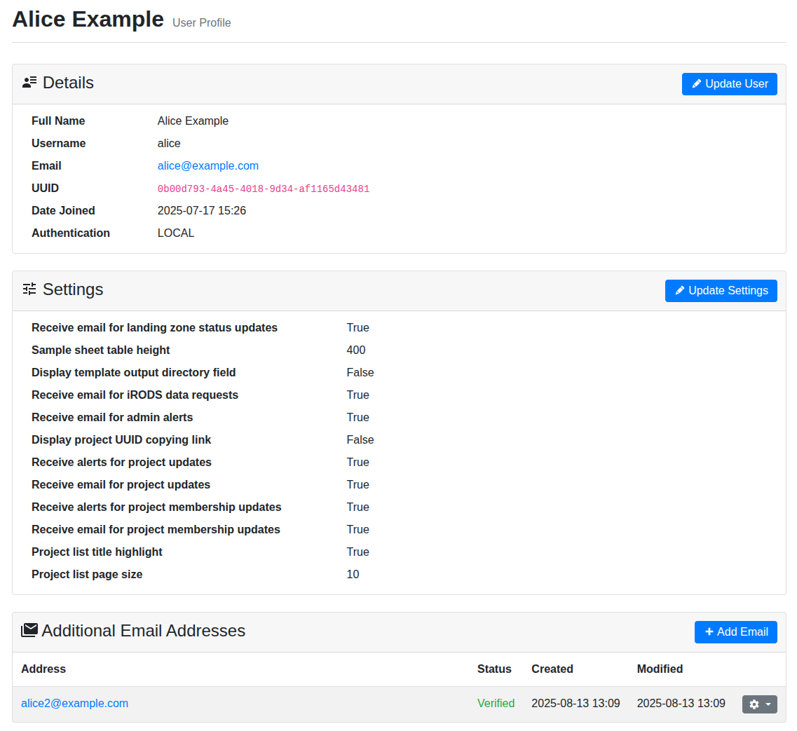
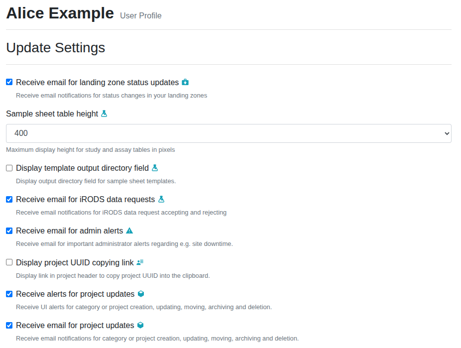

.. _ui_user_profile:

User Profile
^^^^^^^^^^^^

The user profile screen displays information regarding your account. The user
profile displays your information and provides functionality for managing your
user details.

    User profile view

User Settings
=============

Through the user profile, you can modify global user-specific settings for your
account by clicking the :guilabel:`Update Settings` button. The following user
settings are available:

Receive email for landing zone status updates
    Receive email notifications for status updates on your own landing zones.
    If unchecked, you can still see the alerts in the SODAR GUI.
Sample sheet table height
    Choose the maximum height of study and assay tables in the sample sheets app
    from a set of options. In browsing mode, table height will fit the table
    content if the height of content is lower than the setting. In edit mode,
    the chosen table height will be maintained regardless of content.
Display template output directory field
    Display or hide the "output directory" field in sample sheet template
    creation form. This can be enabled if there is need to control the output
    directory in sample sheet ISA-Tab exports. Defaults to false.
Receive email for iRODS data requests
    Receive email notifications for iRODS data request accepting or rejecting.
    If unchecked, you can still see the alerts in the SODAR GUI.
Receive email for admin alerts
    Receive email notifications for admin alerts where the admin has enabled
    email alering. If unchecked, you can still see the alerts in the SODAR GUI.
Display project UUID copying link
    Enabling this will add an icon next to the project title on each project
    view. Clicking it will copy the project identifier (UUID) into the
    clipboard.
Receive alerts for project updates
    Receive UI alerts for category or project creation, updating, moving,
    archiving and deletion.
Receive email for project updates
    Receive email notifications for category or project creation, updating,
    moving and archiving.
Receive alerts for project membership updates
    Receive UI alerts for category or project membership updates and invitation
    activity.
Receive email for project membership updates
    Receive email notifications for category or project membership updates and
    member invitation activity.
Project list title highlight
    Highlight project title in paths displayed in the project list.
Project list page size
    Amount of projects per page in the project list.

    User settings view

Additional Emails
=================

You can configure additional emails for your user account in case you want to
receive automated emails to addresses other than your account's primary
address. The user profile view displays additional emails and provides controls
for managing these addresses.

A new email address can be added with by clicking on the :guilabel:`Add Email`
button. After creation, a verification email will be sent to the specified
address. Opening a link contained in the email will verify the email. Only
verified email addresses will receive automated emails from SODAR.

For each email address displayed in the list, there are controls to re-send the
verification email in case of an unverified email and deleting the address.

Update User Details
===================

If local users are enabled on the site and you have a local SODAR account, the
profile also includes the :guilabel:`Update User` button. This opens a form in
which you can update your details and password. This form is **not** available
for users authenticating with an existing user account via LDAP.

Deactivating Your Account
=========================

Currently, only administrators are able to deactivate user accounts. To get
your user account deactivated, contact your instance's support email or
administrators. After deactivation you will no longer be able to log in to the
SODAR instance or access the REST API. You will also not receive any further
notification emails from the server.
